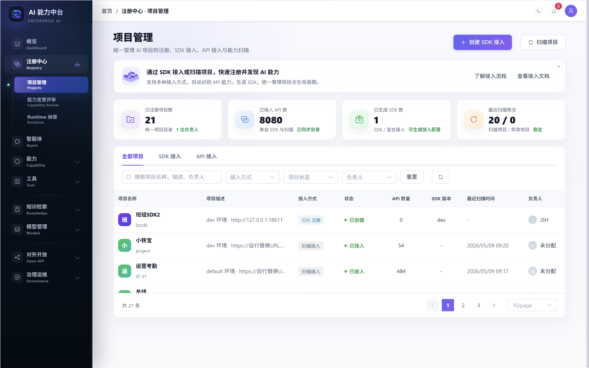
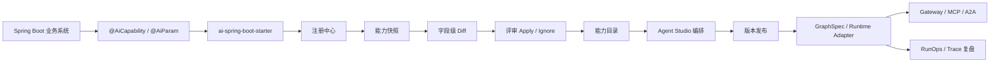
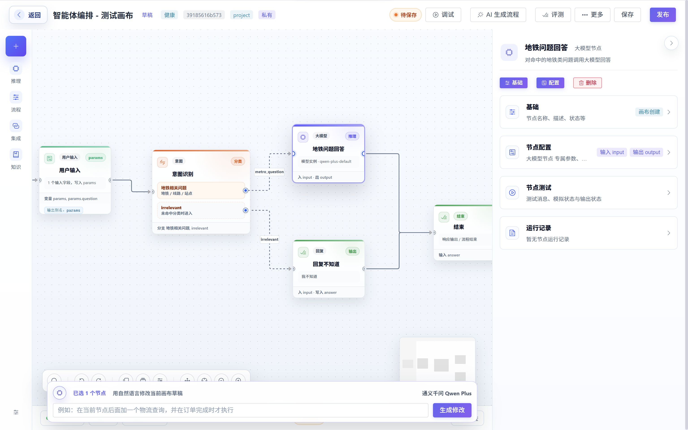
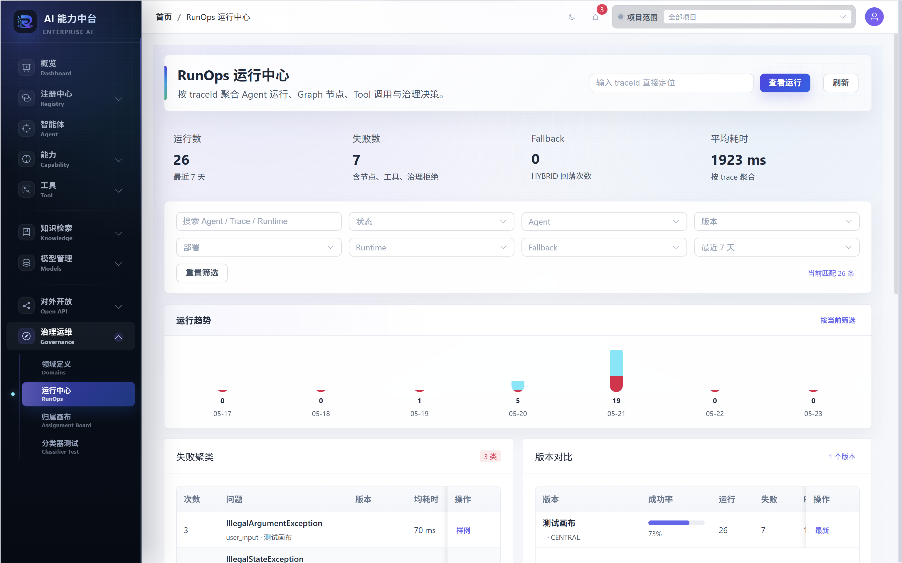
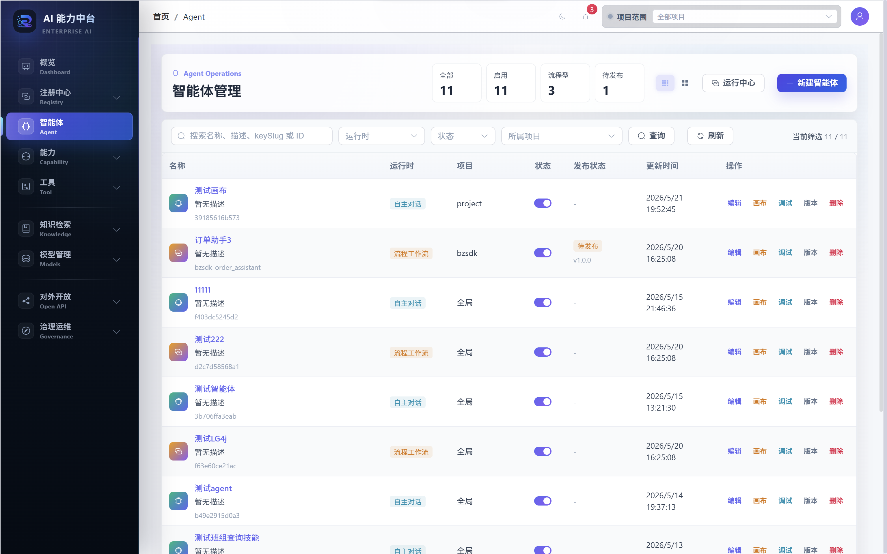
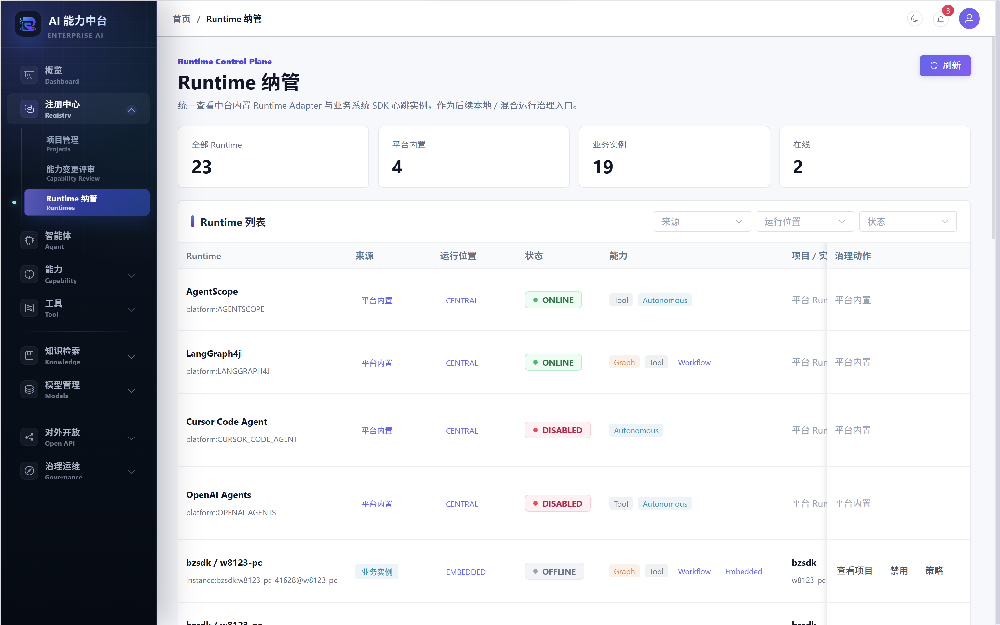
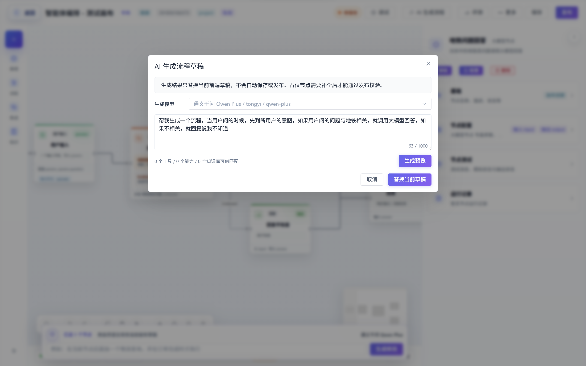
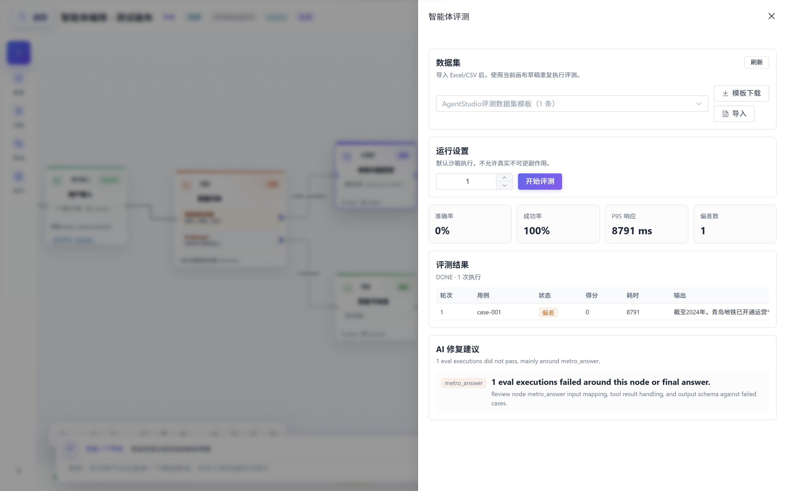

<p align="center">
  
</p>

<h1 align="center">睿池 ReachAI</h1>

<p align="center">
  <strong>面向 Java 企业系统的 AI 能力中台</strong>
</p>

<p align="center">
  让 Spring Boot 业务系统像注册微服务一样注册 AI 能力，并在进入 Agent 前完成治理、编排、发布、审计和开放。
</p>

<p align="center">
  <a href="https://openjdk.org/projects/jdk/17/"></a>
  <a href="https://spring.io/projects/spring-boot"></a>
  <a href="https://spring.io/projects/spring-ai"></a>
  <a href="https://vuejs.org/"></a>
  <a href="LICENSE"></a>
</p>



## 为什么需要 ReachAI

企业 AI 落地真正困难的不是接入一个大模型，而是让模型安全、稳定、可控地调用企业已有能力。

在真实业务系统里，接口和领域方法早已存在，但它们通常缺少面向 Agent 的语义、权限、审计和变更治理：

- 哪些接口可以被 Agent 调用，哪些必须人工审批？
- 一个接口参数变更后，哪些 Agent、工作流和外部调用会受影响？
- 同名 Tool、同名能力、不同项目、不同环境之间如何隔离？
- AI 生成的流程如何发布、回滚、评测和追踪？
- MCP、A2A、Gateway、Trace、ACL、Guard、人工确认如何放到同一条生产链路里？

ReachAI 试图解决的是这一层：**把 Java 企业系统中的接口、领域方法、知识、模型和流程，沉淀为可治理、可编排、可开放的 AI 能力资产。**

## 核心闭环

ReachAI 的主线不是单纯的 Workflow Builder，也不是只扫描历史项目生成 Tool，而是一条从业务系统到生产 Agent 的完整链路。



推荐新系统和核心系统使用 `ai-spring-boot-starter` 主动注册；平台侧 OpenAPI / Controller / DTO 扫描保留给存量系统和低改造场景。

## 你可以用它做什么

| 场景 | ReachAI 解决的问题 |
| --- | --- |
| Java 系统 AI 化 | 将 Spring Boot 接口和领域方法声明为 Agent 可理解、可调用、可治理的能力 |
| 能力注册中心 | 管理项目、实例、能力快照、字段级 diff、评审记录和稳定引用 |
| Agent Studio | 用可视化画布和 AI 指令编排 Tool、Capability、Knowledge、HTTP、MCP 和人工审批节点 |
| 生产治理 | 在能力进入 Agent 前加入 ACL、副作用等级、不可逆调用闸口、Preflight、Trace 和审计 |
| 运行时解耦 | 用统一 `GraphSpec` 连接 Studio、AI 生成/修改、SDK 图同步、发布校验和 Runtime Adapter |
| 能力开放 | 通过 Gateway、MCP、A2A 把已治理的 Agent 和 Capability 暴露给 IDE、外部 Agent 或业务系统 |
| 企业上下文 | 管理模型实例、知识库、业务索引、领域归属和市场资产，让 Agent 使用可信上下文 |

## 从代码注册一个能力

业务系统引入 Starter 后，可以用 Java 注解补充业务语义。ReachAI 会在应用启动时同步项目、实例、能力快照和 SDK 图。

```java
@AiCapability(
    name = "queryContract",
    title = "查询合同",
    description = "按合同编号查询合同基础信息和审批状态",
    domain = "contract",
    module = "contract-query",
    tags = {"合同", "审批"},
    sideEffect = SideEffectLevel.READ_ONLY,
    requiredRoles = {"contract.reader"}
)
@GetMapping("/contracts/{contractNo}")
public ContractDTO queryContract(
    @AiParam(description = "合同编号", required = true, example = "HT-2026-0001")
    @PathVariable String contractNo
) {
    return contractService.query(contractNo);
}
```

```yaml
eaf:
  registry:
    url: http://localhost:8603
    app-key: contract-center
    app-secret: change-me
    heartbeat-interval-ms: 30000
  project:
    code: contract-center
    name: 合同中心
    base-url: http://contract-center:8080
    environment: prod
    visibility: PROJECT
  capability:
    scan-controller: true
    sync-on-startup: true
```

同步后，平台不会直接覆盖生产能力目录，而是形成可评审的治理链路：

1. 注册业务项目和运行实例。
2. 上报实例心跳、版本、host、port、SDK 版本。
3. 扫描 Spring MVC Mapping、`@AiCapability`、`@AiParam` 和请求体结构。
4. 生成能力快照和字段级 diff。
5. 经评审后 apply 到正式能力目录。
6. 通过 HMAC 签名保护注册、心跳和同步请求。

## Agent Studio 与 Runtime



Agent Studio 是把能力资产组织成可发布 Agent 的工作台。它的重点不是只画一个流程图，而是把可视化画布、AI 生成工作流、AI 修改工作流、SDK 图同步、发布校验和 Runtime 执行收敛到统一 `GraphSpec`。

当前已支持的 Studio 节点包括：

- LLM、Tool、Capability、HTTP 请求、MCP 调用。
- 用户输入、参数提取、条件、循环、变量赋值、变量聚合。
- 知识检索、知识写入、文档抽取。
- 人工审批、代码节点、最终回答。

后端 Runtime 通过 `AgentRuntimeAdapter` 屏蔽具体框架差异。当前主线包括 AgentScope 自主智能体和基于 `GraphSpec` / LangGraph4j 的工作流智能体；OpenAI Agents、Cursor Code Agent 等适配器保留为扩展边界。

## 运行治理与开放协议



ReachAI 把“能力能不能被调用、由谁调用、为什么允许或拒绝、出了问题如何复盘”作为平台核心能力之一。

| 能力 | 当前覆盖 |
| --- | --- |
| Tool ACL | 角色、项目、目标能力、权限、启停和 explain 决策 |
| Guard / Preflight | 发布或运行前检查能力可用性、项目边界、副作用等级和不可逆调用授权 |
| Trace / RunOps | 聚合 Tool log、节点 span、Guard 决策、版本快照和 GraphSpec |
| Gateway | 暴露可调用 Agent 和公开/共享能力目录 |
| MCP | 管理 Client 凭证、可见性白名单和调用流水 |
| A2A | 管理 AgentCard endpoint、调用日志和任务状态 |

## 产品截图

| 智能体管理 | Runtime 纳管 |
| --- | --- |
|  |  |
| AI 生成 Workflow 草稿 | Workflow 智能体自动测评 |
|  |  |

## 当前已落地

- `ai-spring-boot-starter` 主动注册项目、实例、能力和 SDK 图。
- `@AiCapability`、`@AiParam`、`@AiOutput` 能力声明契约。
- 能力快照、字段级 diff、评审 apply、稳定引用和项目隔离。
- Agent Studio 画布、AI 生成流程、AI 局部修改流程、调试、发布和评测入口。
- 统一 `AgentGraphSpec`，区分画布布局和运行时语义。
- AgentScope 与 LangGraph4j Runtime Adapter，支持中心、本地、混合运行边界。
- 模型实例、知识库、业务索引、领域归属和市场资产基础能力。
- Tool ACL、Guard 决策日志、Trace、RunOps、Gateway、MCP、A2A 基础入口。
- 聚合 SQL 基线 `sql/init.sql`，覆盖注册中心、能力、Agent、知识、模型、治理和开放协议数据表。

## 仍在推进

- 更完整的 GuardRuntime：限流、熔断、人工确认、跨协议统一策略和成本归集。
- 更清晰的示例业务系统：例如合同中心或订单中心，从 SDK 注册跑通到 Gateway 调用。
- 更成熟的资产市场：版本、依赖影响分析、跨项目复用和审批流。
- 更稳定的用户操作手册：围绕注册、评审、编排、发布、追踪形成完整教程。
- 历史 `Skill` 命名继续向产品语义 `Capability / 能力` 收敛，同时保留存储和接口兼容。

## 快速开始

### 1. 克隆项目

```bash
git clone https://github.com/w8123/EnterpriseAgentFramework.git
cd EnterpriseAgentFramework
```

### 2. 启动基础设施

```bash
docker compose -f deploy/docker-compose.infra.yml up -d
```

基础设施包含 MySQL、Redis、Milvus、Nacos 等。

### 3. 初始化数据库

```bash
mysql -h localhost -u root -proot < sql/init.sql
```

### 4. 构建后端

```bash
mvn clean install -DskipTests
```

### 5. 启动服务

```bash
# 模型网关，默认 8601
cd ai-model-service
mvn spring-boot:run

# RAG、知识库、扫描和语义基础能力，默认 8602
cd ../ai-skills-service
mvn spring-boot:run

# Agent 编排、AI 注册中心、治理与开放协议，默认 8603
cd ../ai-agent-service
mvn spring-boot:run
```

### 6. 启动管理端

```bash
cd ai-admin-front
npm install
npm run dev
```

访问 [http://localhost:5200](http://localhost:5200)。

## 模块结构

| 模块 | 说明 | 默认端口 |
| --- | --- | --- |
| `ai-skill-sdk` | 能力声明注解与 Tool / Capability 开发契约 | - |
| `ai-spring-boot-starter` | 业务系统接入 SDK，支持注册、心跳、能力同步、SDK 图同步和嵌入式 Runtime | - |
| `ai-agent-service` | Agent、注册中心、能力目录、Studio、Runtime、RunOps、MCP/A2A、治理与市场 | 8603 |
| `ai-skills-service` | 知识库、文档处理、RAG、业务索引、扫描器和向量化辅助 | 8602 |
| `ai-model-service` | 模型实例、Chat、Embedding、Rerank、OpenAI 兼容代理 | 8601 |
| `ai-common` | 公共 DTO、异常、配置 | - |
| `ai-admin-front` | Vue 3 管理端，承载注册中心、Agent、知识、模型、治理和开放协议页面 | 5200 |
| `deploy` | Docker Compose、Kubernetes、Dockerfile | - |
| `sql` | 聚合初始化脚本，当前以 `sql/init.sql` 作为统一 SQL 基线 | - |
| `docs` | 当前系统权威知识库和产品截图 | - |

```text
EnterpriseAgentFramework/
├─ ai-skill-sdk/             能力声明与 SDK 契约
├─ ai-spring-boot-starter/   Spring Boot 主动注册 Starter
├─ ai-agent-service/         Agent、注册中心、治理、开放协议
├─ ai-skills-service/        RAG、知识、扫描、语义基础层
├─ ai-model-service/         模型网关
├─ ai-admin-front/           管理端
├─ deploy/                   部署配置
├─ sql/                      聚合初始化脚本
└─ docs/                     当前文档与产品截图
```

## 技术栈

| 层级 | 技术 |
| --- | --- |
| 后端 | Java 17、Spring Boot 3.4、Spring Cloud 2024、Spring Cloud Alibaba |
| AI | Spring AI 1.0、Spring AI Alibaba、AgentScope、LangGraph4j |
| 数据 | MySQL 8、Redis 7、Milvus 2.4 |
| ORM | MyBatis-Plus |
| 文档与扫描 | JavaParser、Apache POI、PDFBox |
| 前端 | Vue 3、Vite 6、Element Plus、TypeScript、Pinia、Vue Flow、AntV G6 |
| 部署 | Docker、Kubernetes |

## 文档导航

| 文档 | 内容 |
| --- | --- |
| [文档入口](docs/README.md) | 当前系统权威知识库入口和阅读顺序 |
| [平台定位与架构总览](docs/01-平台定位与架构总览.md) | 系统定位、服务边界、管理端功能地图和统一 SQL 基线 |
| [项目注册与能力资产](docs/02-项目注册与能力资产.md) | 扫描、SDK 注册、能力同步、Tool/Capability 资产模型 |
| [Agent Studio 与 Runtime](docs/03-Agent-Studio与Runtime.md) | Agent Studio、GraphSpec、发布、评测、多 Runtime 和变量映射 |
| [运行治理与开放协议](docs/04-运行治理与开放协议.md) | Trace、RunOps、ACL、Guard、MCP、A2A、Gateway |
| [知识模型与企业资产](docs/05-知识模型与企业资产.md) | 模型实例、知识库、业务索引、领域、市场资产 |

## 命名说明

- 产品语义中，可编排、可治理的粗粒度业务单元统一称为 **Capability / 能力**。
- 历史代码、接口和数据表中仍可能出现 `skill`、`skills`、`skill_draft`、`skill_interaction` 等命名，这是 legacy storage/API naming。
- `ai-skills-service` 主要承载知识检索、扫描和语义基础能力，模块名暂不强制 rename。

## 交流

如果你也在做 Java + AI、企业 AI 中台、Agent 治理平台，欢迎交流：

- QQ 群：1073839193

## 开源协议

本项目基于 [MIT License](LICENSE) 开源。
