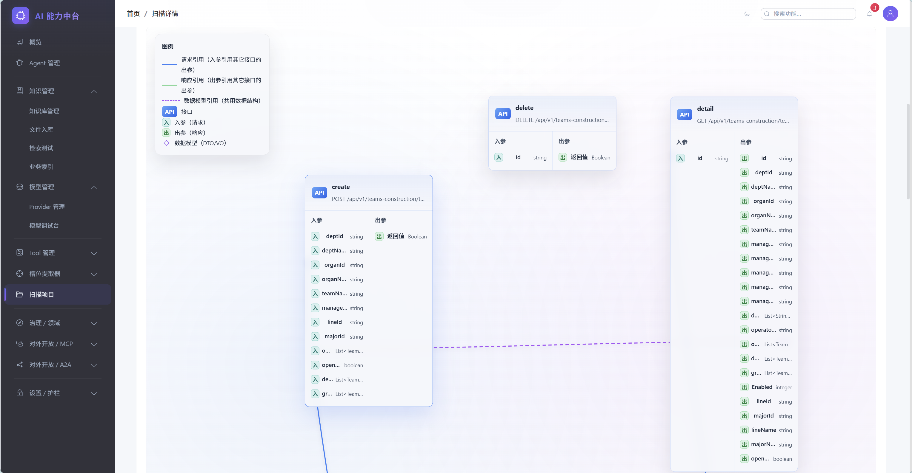
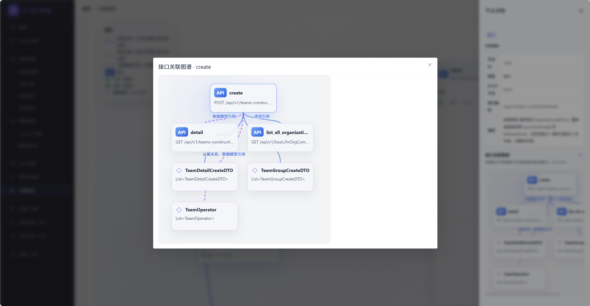

# 🏢 Enterprise Agent Framework

**让每一个 Java 企业系统，都能拥有自己的 AI Agent**


**中文**

*一套开箱即用的企业级 AI Agent 基础设施平台 — 统一智能体编排、Skill 三态封装、Tool 治理护栏、RAG 知识引擎、模型网关与 Trace 全链路追踪，帮助 Java 企业在尽量不改动历史项目的前提下，快速落地 AI Agent 项目。*

本仓库的定位正在从「对话型 Agent 后台」演进为**企业 AI 能力中台**：一方面通过 **Skill SDK / AiTool** 把存量业务 API 变成 Agent 可调用的工具，并以 **Skill 三态**（SubAgent / InteractiveForm / AugmentedTool）把多步业务流程从 ReAct 不稳定决策中摘出来（**业务能力 → Agent**）；另一方面通过 **Agent Studio** 让运营同学画布化编排 Agent，并以 **Tool ACL + sideEffect 闸口 + Trace 回放** 提供企业治理护栏（**AI 能力 → 业务系统**）。编排层、Skill 层、RAG、模型网关、Tool Retrieval 与 Trace 体系共享同一套底座。

---

## 🔥 为什么需要这个项目？

在 AI Agent 的浪潮中，Python 生态（LangChain、AutoGen 等）占据了绝大多数开源方案。但现实是：

> **中国 80% 以上的企业核心系统是 Java 技术栈。**

这意味着：

- 🏗️ 存量系统庞大 — 数百万行 Spring Boot / SSM / Dubbo 代码不可能推倒重来
- 🔌 接入成本高 — 若核心链路再叠一层异构 Agent 运行时，与现有服务、权限、运维体系对齐成本显著上升
- 👥 团队与交付 — 多数企业 Java 团队占比高，在熟悉栈内落地 AI「增强能力」迭代更快、维护更稳
- 🧩 AI 是增强能力而非孤岛 — 常要嵌入审批、检索、定时任务等流程；Python 生态在模型与脚本侧很丰富，本框架以 **Java 为编排与业务集成核心**，数据处理等辅助场景可继续用 Python，并**预留跨语言 Tool 协议**（如 MCP 思路）

**Enterprise Agent Framework 就是为解决这个问题而生的。** 它是一套以 **Java 为核心技术栈**的企业级 AI Agent 基础设施，让 Java 团队用最熟悉的技术，以较低成本落地智能体与中台化能力；不与 Python 生态对立，而是在企业集成面上优先 Java。

---

## ✨ 核心特性

### 🤖 智能体编排引擎

- 基于 **AgentScope + Spring AI** 的 ReAct Agent，支持意图识别、多步推理、Tool 自动调用
- **AgentDefinition 已 DB 化**（`agent_definition` 表），首次启动自动从旧 `agent_definitions.json` 迁移，运营同学在管理后台即可新增 / 编辑 / 启停 Agent
- **版本灰度发布**（`agent_version` 表）— 每次 Studio 发布生成不可变快照，按 `userId` hash 落桶实现按比例灰度，一键回滚
- **双入口**：内部 `POST /api/agent/execute` 走 `agentId`；外部 `POST /api/v1/agents/{key}/chat` 通过 `keySlug` 暴露给业务系统
- 内置 `AgentRouter` 意图路由 + 单 Agent / Pipeline 多 Agent 协作；完整会话记忆管理（Redis 短期窗口）

### 🧠 Skill 层（多步业务流程的"能力原子"）

- **三态 + 一态**：把多步业务流程从 ReAct 不稳定决策里摘出来，封成 LLM 可调的"粗粒度黑盒"
  - **SubAgentSkill** — 子 Agent，独立 systemPrompt + 工具白名单，最大嵌套深度 3 层（Phase 2.0 ✅）
  - **InteractiveFormSkill** — 确定性槽填充 + 挂起 / 恢复 + UI 原语协议，支持表单卡 / 摘要卡 / 字典预拉（Phase 2.x ✅）
  - **AugmentedTool** — 单 Tool 的前 / 后处理装饰器（Phase 2.2 ⏳ 规划中）
  - **WorkflowSkill** — 已并入 Agent Studio 的画布产物，不再独立立项
- SDK 契约：`AiSkill extends AiTool`，对 LLM 透明；`SkillKind` / `SkillMetadata` / `SideEffectLevel` / `HitlPolicy` 完整治理元数据
- 复用 `tool_definition.kind=SKILL` 一张表存 Tool + Skill，避免双 CRUD / 双向量池

### 🛠️ 尽量不改动接入历史系统

- **独创的 Skill SDK 体系** — 老系统无需改动或极少改动，通过 HTTP 桥接即可将业务 API 变为 Agent 可调用的 Tool
- 标准化的 `AiTool` 接口契约，实现即注册，开箱即用
- **运行时 Web 扫描链路** — 管理后台录入项目名 / 域名 / 磁盘路径，后端扫描 OpenAPI 或 Controller，结果直接入库并注册为动态 Tool
- 扫描完成后 `ScanModuleService.bootstrapFromTools` 按 Controller 类自动聚合形成模块视图，配合「AI 理解」Tab 一键生成业务语义

### 🔍 Tool Retrieval（语义召回，解决"工具爆炸"）

- 当 Tool 数量从十几个扩张到上百个时，全量塞 system prompt 既贵又选不准
- `tool_embeddings` Milvus collection 按 `ai_description > description > name` 文本召回 top-K
- `RetrievalScope` 多维过滤（`project / module / kinds(TOOL/SKILL) / enabled / agentVisible`）
- **白名单 ∩ 召回**双闸：召回结果与 `AgentDefinition.tools` 求交集，空则回退白名单（保守不阻塞主链路）
- 完整降级矩阵：开关关闭 / Milvus 不可达 / 召回为空 / 抛异常 — 任意一种都安全回退到白名单旧行为

### 🧬 AI 语义理解（让 Agent "看懂"接口而不是只"看到"）

- 扫描出来的 `description` 往往只是方法名 / Swagger 一行空话，Agent 选不准
- 三层语义全手动触发，按粒度生成：
  - **项目级** — README + `pom.xml <description>` + Controller 索引 → 一页业务域说明
  - **模块级** — 默认按 Controller 类聚合，支持手动合并 / 重命名（`scan_module.display_name`）
  - **接口级** — 方法体 + 引用的 Service / Mapper / DTO 源码 → 业务语义 + 参数表 + 注意事项
- `JavaSourceIndex` 顺藤摸到底（构造函数 / 字段引用），**不是只把方法签名喂给 LLM**
- 接口级产出冗余写入 `tool_definition.ai_description`，`DynamicHttpAiTool.description()` 优先使用，Agent 看到的就是业务语义
- 项目级互斥锁 + `force` 语义保留人工编辑版 + `token_usage` 入库便于核算

### 📊 Trace 回放与可观测性

- `tool_call_log` 记录每次 Agent 执行的全部 Tool / Skill 调用（args / result / cost_ms / success / `traceId`）
- `traceId` 通过 `ToolExecutionContextHolder`（ThreadLocal）从父 Agent 传递到子 Skill / 子 Agent，**整条业务流单一 traceId 贯穿**
- 后端 API：`GET /api/traces/{traceId}` 看时间线、`GET /api/traces/recent` 看最近 N 条
- 前端 `TraceTimeline.vue` 按 `agentName` 前缀 `skill:*` **自动折叠父子调用层级**，支持 `argsJson / resultSummary` JSON pretty-print
- Skill 指标 API `GET /api/skills/{name}/metrics?days=7`：P50/P95 延迟 + Token + 调用次数 + 成功率 + 按日趋势
- 入口：Agent 调试台右侧抽屉「查看 Trace」、Agent 列表「最近 Trace」页签、Studio 调试抽屉

### 🛡️ 企业治理护栏

- **`sideEffect` 五级标注**：`NONE / READ_ONLY / IDEMPOTENT_WRITE / WRITE / IRREVERSIBLE`
- 扫描期 `SideEffectInferrer` 基于 HTTP method + path 关键词保守推断；`SideEffectBackfillJob` 启动期一次性回填历史 Tool
- **IRREVERSIBLE 运行时闸口**：`ToolExecutionContext.allowIrreversible=false` 时，`AiToolAgentAdapter.checkSideEffectGate` 在执行前直接拦截不可逆 Tool
- **Tool ACL（角色 × 能力）**：`tool_acl` 表（`role_code × target_kind × target_name → ALLOW/DENY`），`AgentFactory.createToolkit` 装配阶段就把被拒能力摘掉，**LLM 根本看不到**
- 决策：`ALLOW / DENY_EXPLICIT / DENY_NO_MATCH / SKIPPED`；DENY 优先、5 分钟本地缓存、SubAgentSkill 子链继承父 ctx 的 roles
- 管理：CRUD / 批量授权 / 决策诊断（dry-run 输入 roles+targets 看每项决策）

### 🎨 Agent Studio（可视化编排）

- 基于 `@vue-flow/core` 的三栏画布（节点调色板 / 画布 / 属性面板），支持 `start / end / skill / tool / knowledge` 五类节点
- 拖拽投放 + 连线 + 键盘删除；画布 JSON 与 `AgentDefinition` 双向互转（`utils/studio.ts`）
- **调试抽屉**：在画布内通过发布端点 `gatewayChat(keySlug)` 真实走线上链路 → 拉 trace → 复用 `TraceTimeline.vue` 渲染
- **Trace → Skill 一键抽取**：调试抽屉中多选 trace 子序列 → `POST /api/skill-mining/drafts/from-trace` → 进入 Skill 草稿评审
- **发布 / 灰度 / 回滚**：版本号 + 灰度百分比 + 备注 + 发布人；`AgentVersions.vue` 列表查看快照 / 一键回滚
- 与原 `AgentEdit.vue` 表单视图并存，列表页新增「Studio」/「版本」入口

### 📚 RAG 知识引擎

- 文档全生命周期管理：上传 → 解析 → 分块 → Embedding → 向量检索
- 支持 PDF、Word、Excel、TXT 等多种文档格式
- 基于 **Milvus** 的高性能向量检索，支持语义搜索与查重
- 业务索引能力，支持结构化数据的语义搜索
- 多知识库协同检索（KnowledgeBaseGroup）规划中

### 🔗 统一模型网关

- 多模型 Provider 路由（通义千问 / DashScope / OpenAI 兼容接口）
- 统一的 Chat & Embedding API，一次对接，随时切换模型
- 内置 OpenAI 兼容代理，第三方工具与 AgentScope 可直接对接
- 流式 SSE 响应，实时输出

### 🖥️ 可视化管理后台

- 基于 **Vue 3 + Element Plus** 的现代化管理界面
- Agent 生命周期：列表 / 表单视图 / **Agent Studio 画布** / **版本管理 + 一键回滚** / 调试台
- Tool 与 Skill：Tool 管理、**Skill 管理（SUB_AGENT / INTERACTIVE_FORM）**、**Skill 草稿评审（Skill Mining）**、Tool 召回 rebuild
- 治理：**Tool ACL（角色 × 能力）**、决策诊断、扫描项目管理 + **AI 理解 Tab**（项目 / 模块 / 接口三层语义）
- 知识库管理、模型调试、Trace 时间线、Dashboard 一站式搞定

### 🚀 生产级部署方案

- Docker Compose 一键启动全套基础设施（含 MySQL、Redis、Milvus、Nacos 等）
- 提供 Kubernetes 部署清单，支持云原生部署
- 服务间调用以 **OpenFeign** 为主；**Nacos** 可作为注册/配置中心逐步接入
- **统一 AI 入口网关**（Spring Cloud Gateway + 鉴权/限流）规划为独立工程，与业务微服务网关解耦

## 📦 模块说明


| 模块                    | 说明                                                  | 端口   |
| --------------------- | --------------------------------------------------- | ---- |
| **ai-common**         | 公共库 — DTO、异常定义、通用配置                                 | -    |
| **ai-skill-sdk**      | Skill 开发 SDK — `AiTool` / `AiSkill` / `ToolRegistry` / `SkillKind` / `SkillMetadata` / `SideEffectLevel` / `HitlPolicy` | -    |
| **ai-model-service**  | 模型网关 — LLM Chat / Embedding，多 Provider 路由，OpenAI 兼容代理 | 8601 |
| **ai-skills-service** | 知识 / Tooling 基础层 — RAG、文档 Pipeline、向量检索、OpenAPI / Controller 扫描核心、`SemanticContextCollector` 提供语义理解上下文采集 | 8602 |
| **ai-agent-service**  | 智能体编排 — AgentScope、意图识别、会话记忆、**Skill 三态执行**（SubAgent / InteractiveForm）、**Agent Studio 后端**（`AgentVersionService` / `AgentGatewayController`）、**Trace 回放**（`tool_call_log` + `/api/traces/*`）、**Tool ACL**（`ToolAclService`）、**Skill Mining**（`mining/`）、**AI 语义理解编排**（`SemanticGenerationOrchestrator`） | 8603 |
| **ai-admin-front**    | 管理前端 — Vue 3 + Vite + Element Plus + TypeScript + `@vue-flow/core` | 3000 |
| **deploy**            | 部署配置 — Docker Compose / Kubernetes                  | -    |

仓库根目录 `pom.xml` 当前聚合 **5 个 Java 子模块**。扫描核心已并入 `ai-skills-service`；**`ai-admin-front`** 为同目录下的 **npm / Vite 工程**，不参与 Maven 聚合；**`deploy`** 为部署清单目录，同样不在聚合内。

**SQL 迁移脚本**散落在各服务的 `sql/` 目录下，按 Phase 命名：
- `ai-skills-service/sql/`：`init.sql`（冷启动）、`upgrade_v2.sql` ~ `semantic_docs_v6.sql` ~ `scan_project_tool_v7.sql`（按版本递增）
- `ai-agent-service/sql/`：`tool_call_log_v8.sql`、`skill_phase2_0.sql`（Skill 三态）、`skill_interaction_phase2_x.sql`（InteractiveForm）、`skill_mining_phase2_1.sql`（草稿 + 评估快照）、`agent_studio_phase3_0.sql`（Studio + 版本灰度）、`tool_acl_phase3_1.sql`（角色 × 能力 ACL）、`tool_call_log_index_phase2_0_1.sql`（Trace 索引）、`backfill_side_effect.sql`（一次性回填脚本）、`api_graph_phase4_0.sql`（Phase 4.0 接口图谱）
- 根 `sql/init.sql`：聚合冷启动脚本，与各服务 phase 脚本保持同步

---

## 🚀 快速开始

### 环境要求

- **JDK 17+**
- **Maven 3.8+**
- **Node.js 18+**（前端）
- **Docker & Docker Compose**（基础设施）

### 1. 克隆项目

```bash
git clone https://github.com/your-username/EnterpriseAgentFramework.git
cd EnterpriseAgentFramework
```

### 2. 启动基础设施

一键拉起 MySQL、Redis、Milvus、Nacos：

```bash
docker compose -f deploy/docker-compose.infra.yml up -d
```

### 3. 初始化数据库

```bash
mysql -h localhost -u root -proot ai_text_service < ai-skills-service/sql/init.sql
```

### 4. 构建全部 Java 模块

```bash
mvn clean install -DskipTests
```

### 5. 按顺序启动服务

```bash
# 1) 模型网关（其他服务依赖它）
cd ai-model-service && mvn spring-boot:run

# 2) RAG 引擎
cd ai-skills-service && mvn spring-boot:run

# 3) 智能体编排
cd ai-agent-service && mvn spring-boot:run
```

### 6. 启动管理前端

```bash
cd ai-admin-front && npm install && npm run dev
```

访问 **[http://localhost:3000](http://localhost:5200)** 即可进入管理后台。

---

### 运行时 Web 扫描接入

对于已经部署在服务器上的历史 Java 项目，现在优先推荐直接走管理后台的 **扫描项目** 流程：

1. 在管理后台新增扫描项目，填写**项目名称**、**项目域名**、**磁盘路径**、**扫描方式**（OpenAPI / Controller）
2. 后端由 `ai-agent-service` 通过 Feign 调用 `ai-skills-service` 暴露的扫描接口（`/ai/scanner/openapi`、`/ai/scanner/controller`），对磁盘项目进行扫描
3. 扫描结果直接写入数据库：
   - `scan_project`：保存项目元数据、扫描状态、错误信息
   - `tool_definition`：保存接口定义，并用 `project_id` 关联项目
4. 开发者在页面上编辑工具名、描述、参数、开关后，即可直接作为**动态 Tool** 被 Agent 调用

这条链路的特点是：

- **没有 YAML 中间文件**
- **没有必须生成 jar 的前置要求**
- **更适合运维 / 联调 / 快速接入历史系统**

### 扫描后一键生成 AI 理解（Phase 2.x，已实现）

扫描出来的 `description` 往往只是方法名或 Swagger 一行空话，Agent 选不准。进入扫描项目详情页的 **「AI 理解」Tab** 即可一键生成三层语义：

1. **项目级摘要**：基于 README + `pom.xml <description>` + Controller 索引，产出一页业务域说明
2. **模块级说明**：默认按 Controller 类聚合（`scan_module`），支持手动合并多个 Controller、自定义 `display_name`
3. **接口级语义**：方法体 + 引用的 Service / Mapper / DTO 源码，产出业务语义 + 参数表 + 注意事项

接口级产出会冗余写入 `tool_definition.ai_description`，运行时 `DynamicHttpAiTool.description()` 优先返回 `ai_description`，**Agent 看到的就是 LLM 产出的业务语义，而不是原始方法名**。

操作要点：
- 「一键生成 AI 理解」走异步任务 + 进度条轮询；项目级互斥锁防止并发触发
- 人工编辑过的文档 `status=edited`，重生成时默认保留；`force=true` 才覆盖
- `semantic_doc.token_usage` 入库便于成本核算

详见 [docs/AI语义理解-设计与落地.md](docs/AI语义理解-设计与落地.md)。

## 🛠️ 技术栈


| 层级       | 技术                                                               |
| -------- | ---------------------------------------------------------------- |
| **语言**   | Java 17                                                          |
| **框架**   | Spring Boot 3.4 · Spring Cloud 2024.0 · Spring Cloud Alibaba     |
| **AI**   | Spring AI 1.0 · Spring AI Alibaba (DashScope) · AgentScope 1.0.9 |
| **数据**   | MySQL 8 · Redis 7 · Milvus 2.4                                   |
| **注册中心** | Nacos 3.0（可选；与统一网关能力持续完善中）                                  |
| **ORM**  | MyBatis-Plus 3.5                                                 |
| **文档解析** | Apache POI 5.2 · PDFBox 2.0                                      |
| **前端**   | Vue 3 · Vite 6 · Element Plus · TypeScript · Pinia               |
| **部署**   | Docker · Kubernetes                                              |


---

## 🗺️ 路线图

> 本节状态图标与 [docs/产品演进路线-Skill-AgentStudio-护栏.md](docs/产品演进路线-Skill-AgentStudio-护栏.md) 顶部进度看板严格对齐：✅ 已交付 / 🟡 已交付待验证 / 🔨 进行中 / ⏳ 规划中 / ⚠️ 已降级。

### ✅ 已完成（Phase 0 ~ 3.1）

- ✅ **AI Agent 编排引擎** — AgentScope + Spring AI ReAct Agent + 意图路由；`/api/chat`、`/api/agent/execute`、`/api/agent/execute/detailed` 三入口
- ✅ **RAG 知识引擎** — 文档 Pipeline + Milvus 向量检索 + 业务索引（结构化数据语义搜索）
- ✅ **统一模型网关** — 多 Provider 路由（通义千问 / DashScope / OpenAI 兼容）+ SSE 流式 + OpenAI 兼容代理供 AgentScope 使用
- ✅ **Skill SDK 体系** — `AiTool` / `AiSkill` / `ToolRegistry` / `SkillKind` / `SkillMetadata` / `SideEffectLevel` / `HitlPolicy` 完整契约
- ✅ **扫描项目 Web 化闭环** — `scan_project` + `tool_definition.project_id` + `/api/scan-projects/*` + 管理端列表 / 详情页 + 动态 Tool 直接入库；`ScanModuleService.bootstrapFromTools` 扫描后自动按 Controller 类聚合模块
- ✅ **AgentDefinition DB 化 + 版本灰度（Phase 3.0）** — `agent_definition` / `agent_version` 表；首次启动自动从 `agent_definitions.json` 迁移；`AgentVersionService.publish / rollback / resolveActiveSnapshot`（按 `userId` hash 落桶）
- ✅ **Phase 1 Tool Retrieval + tool_call_log** — Milvus `tool_embeddings` 召回；`RetrievalScope`（project / module / kinds / enabled / agentVisible）；白名单 ∩ 召回双闸；完整降级矩阵；`tool_call_log.retrieval_trace_json` 沉淀语料
- ✅ **Phase 2.0 SubAgentSkill MVP** — `AiSkill extends AiTool`；`SubAgentSkillExecutor` 嵌套深度上限 3 + `ToolExecutionContextHolder` 传 trace；扫描期 `SideEffectInferrer` 推断；`SkillController` CRUD + 测试；前端 Skill 管理页
- ✅ **Phase 2.0.1 可信度补强** — `Mono.timeout + retryWhen` 真正消费 `timeoutMs / retryLimit`；`SkillTimeoutException` 结构化错误；`SideEffectBackfillJob` 启动期回填；`/api/skills/{name}/metrics` 指标 API；Skill 评估指标 SQL 口径文档化
- ✅ **Trace 回放全链路** — `GET /api/traces/{traceId}` + `GET /api/traces/recent`；前端 `TraceTimeline.vue` 按 `skill:*` 前缀自动折叠父子层级；Agent 调试台抽屉、Agent 列表「最近 Trace」页签、Studio 调试抽屉三入口
- 🟡 **Phase 2.1 Skill Mining 骨架** — `ToolChainAggregator` 聚合 + `PrefixSpanMiner`（distinct trace 支持度）+ `SkillDraftLlmWriter`（当前模板策略，预留 LLM 入口）+ `SkillMiningService`（precheck + 幂等 generate / publish）+ `SkillEvaluationScheduler`（每日 02:00 自动评估 + `ROLLBACK_CANDIDATE` 标记）+ 前端 `SkillMining.vue` 评审页；**等待真实 `tool_call_log` 数据验证**
- ✅ **Phase 2.x InteractiveFormSkill** — 确定性槽填充 + `skill_interaction` 挂起 / 恢复表 + `expires_at` TTL + UI 原语协议（form / summary_card）+ `ChatRequest.uiSubmit` / `ChatResponse.uiRequest` + `AgentDebug.vue` `DynamicInteraction.vue` 渲染；PoC `create_team_interactive`
- ✅ **Phase 3.0 Agent Studio v0** — `@vue-flow/core` 三栏画布 + 调试抽屉 + `gatewayChat(keySlug)` 真实链路调试 + 发布弹窗（版本号 / 灰度 / 备注 / 发布人）+ 一键回滚 + Trace → Skill 一键抽取 + IRREVERSIBLE 运行时闸口
- ✅ **Phase 3.1 Tool ACL** — `tool_acl` 表 + `ToolAclService.decide` 四态判定（ALLOW / DENY_EXPLICIT / DENY_NO_MATCH / SKIPPED）+ DENY 优先 + 5min 本地缓存 + `AgentFactory.createToolkit` 装配过滤 + `ChatRequest.roles` 全链路透传 + SubAgentSkill 子链继承 roles + 管理端 CRUD / 批量授权 / 决策诊断三板斧
- 🟡 **Phase 4.0 接口图谱一期** — `api_graph_node / api_graph_edge / api_graph_layout` 三表 + `ApiGraphRepository` 抽象 + `MysqlApiGraphRepository` 默认实现；扫描完成 hook 自动投影 API/FIELD/DTO/MODULE 节点 + 推断 `MODEL_REF` 紫色虚线边；运营在 AntV G6 v5 画布上手动连接「请求引用」蓝线 / 「响应引用」绿线，支持节点/边类型过滤、布局持久化、PNG 导出；ScanProjectDetail 末尾折叠卡懒加载入口；二期叠加自动启发式推断 + 运行时挖掘 + AI 反哺
- ✅ **AI 语义理解（Phase 2.x 叠加）** — 三层语义（项目 / 模块 / 接口）+ `JavaSourceIndex` 顺藤摸到底 + `tool_definition.ai_description` 直接喂 Agent + 项目级互斥锁 + `force` 保留人工编辑 + `token_usage` 入库
- ✅ **会话记忆（Redis 短期窗口）** + **管理后台**（Agent / Skill / Skill Mining / Studio / 版本管理 / Tool / Tool ACL / 知识库 / 模型 / 扫描项目 + AI 理解 Tab / Trace / Dashboard）+ **Docker / K8s 部署方案**

### 🔨 进行中（高优先级 backlog）

- 🔨 **Skill Mining 真实数据验证 + LLM 反写** — 阈值调优（minSupport / days / limit）；草稿 Levenshtein + Jaccard 语义去重；`SkillDraftLlmWriter` 接 ChatClient 做 systemPrompt / description 反写
- 🔨 **令牌桶限流（Redis）** — 不加限流，一个 prompt 错误可能把下游 HTTP 打挂；与 Phase 3.1 Tool ACL 同属 §3.2 Backlog P0，**Phase 3.1 后必须先补齐才能开放 Studio 发布端点**
- 🔨 **Studio 培训物料** — 操作录屏 30s × 3 + 一份运营手册 PDF，画布交付后没培训运营不会用
- 🔨 **AugmentedTool（Phase 2.2）** — 单 Tool 前 / 后处理装饰器，复用 `SubAgentSkillExecutor` 可靠性外壳
- 🔨 **AI 能力 REST（`/api/ai/*`）** — 面向业务系统的标准化能力面（生成 / 审查 / 抽取 / 检索 / 摘要 / 问答 / 数据查询）
- 🔨 **多知识库协同检索** — `KnowledgeBaseGroup` 多 Collection 与结果融合

### ⚠️ 已降级 / 中期 backlog（Phase 3.x ~ 4.x）

- ⚠️ **HITL 执行流** — Demo / POC 阶段 ROI 低，`HitlPolicy` 字段保留，运行时暂不实现；Studio 发布到生产前再单独立项
- ⏳ **画布条件边 / 并行 / 循环节点**（`canvas-control-flow`，§3.2 Backlog P1）
- ⏳ **prompt diff 视图**（`prompt-diff`，回滚时运营看不到 prompt / tools 差异，§3.2 Backlog P1）
- ⏳ **灰度策略增强**（A/B、按租户、按 header；当前只有 user-hash 一种，§3.2 Backlog P2）
- ⏳ **跨 trace 对比 / 时间轴缩放**（`trace-advanced`，§3.2 Backlog P2）
- ⏳ **RAG Embedding 解耦** — `ai-skills-service` 侧 Embedding 调用统一改走 `ai-model-service`
- ⏳ **源码级扫描增强** — Service 层 / JavaDoc 深扫；差异对比；增量更新
- ⏳ **RemoteToolProvider / MCP 兼容** — 跨语言 Tool 接入
- ⏳ **AI Gateway（独立工程）** — 统一入口、鉴权、限流、熔断
- ⏳ **Agent / Skill 市场**（`agent-marketplace`，§3.2 Backlog P3，跨项目复用）

---

### 🚀 未来规划（设计中，未开工）

> 以下 7 项是基于现有架构的演进方向，**均处于规划阶段，未开工**。每项给出 3 行：痛点 → 方案要点 → 与现有模块关系。

#### 1. 意图识别模块（IntentRecognition）

- **痛点**：当前 `IntentService` 候选随 `AgentDefinition` 静态生成，每次都要用 LLM 兜底分类，成本高、延迟敏感场景下抖动明显
- **方案要点**：独立 `intent-classifier` 子模块；离线训练小模型（FastText / 小 BERT）做本地快速分类，支持多标签 + 置信度阈值；置信度低于阈值再走 LLM 兜底；`tool_call_log.intent_type` 历史样本作为训练语料的天然来源
- **与现有模块关系**：替换 `AgentRouter` 上游的意图识别步骤；保留原 LLM 兜底链路；与 Skill Mining 共享 `tool_call_log` 数据底座，形成"调用日志 → 训练样本 → 分类器 → 路由决策 → 调用日志"的闭环

#### 2. 多用户记忆管理（MemoryHub）

- **痛点**：当前仅 Redis 短期会话窗口，跨会话 / 跨 Agent 无法复用用户偏好与事实（昵称、常用部门、历史决策）；每次都要用户重新交代上下文
- **方案要点**：分层记忆（Redis 短期 + MySQL `user_memory` / `user_fact` 长期 + Milvus 语义检索）；隐私分级（PUBLIC / PRIVATE / SENSITIVE）+ TTL 过期；显式记忆（用户主动说"记住"）+ 隐式记忆（LLM 抽取 + 人工确认）双通道
- **与现有模块关系**：在 `AgentRouter` 注入前 hook，按当前用户 + 当前问题召回相关记忆，写入 `ToolExecutionContext.userMemorySnapshot`；与 Tool ACL 协同，敏感记忆按 `roles` 过滤；与 Skill Mining 共享 `traceId` 关联用户行为序列

#### 3. 领域识别（DomainClassifier）

- **痛点**：多业务线 Agent 共享同一 Tool 池子时，Tool Retrieval 会跨域召回（财务 Agent 召回 HR 工具）；Agent 选不准、Token 浪费
- **方案要点**：基于扫描项目 + 知识库分组 + Skill 标签自动生成领域标签体系（`domain` 维度，如 `finance / hr / crm / legal`）；输入文本经轻量分类先确定领域 → 候选 Agent / Tool / Knowledge 子集；领域标签与 `scan_project` 一对多挂接
- **与现有模块关系**：叠加在 Tool Retrieval 之前作为 `RetrievalScope.domain` 过滤维度（与 `kinds / project / module` 并列）；与多用户记忆联动（用户惯用领域作为软偏好）；与 Tool ACL 互补（ACL 是硬权限，Domain 是软路由）

#### 4. 接口调用图谱（ApiCallGraph） — 🟡 一期已交付（Phase 4.0）

- **痛点**：动态 Tool 上百个后看不出调用关系（哪个 Tool 经常和哪个 Tool 同链路？哪些 Tool 被孤立？）；扫描出来的接口参数来源散乱，运营梳理只能看文字
- **一期方案（已交付）**：扫描完成后把 `scan_project_tool` + 嵌套 `ToolDefinitionParameter` 树投影成 `api_graph_node`（API / FIELD_IN / FIELD_OUT / DTO / MODULE）；同项目内引用同 DTO 的字段自动连接 `MODEL_REF` 紫色虚线边；运营在画布上手动连接「请求引用」蓝线 / 「响应引用」绿线；前端 AntV G6 v5 渲染交互式图谱，支持节点 / 边类型过滤、布局持久化、PNG 导出。所有图访问统一走 `ApiGraphRepository` 抽象，二期可平滑挂图 DB 副本（Nebula / Neo4j）
- **二期规划（未启动）**：① 启发式自动推断蓝/绿边（同名+同类型字段）；② 运行时挖掘（`tool_call_log.args_json` 同 traceId 字段值匹配，反推真实跨接口数据流）；③ AI 反哺（`buildParamSourceHint` 把"userId 通常来源 user_login 出参"拼接到 `DynamicHttpAiTool.description()`，让 LLM 选 Tool 时直接看到参数依赖）
- **与现有模块关系**：消费 Phase 2.1 `ToolChainAggregator` 已聚合好的运行时序列（二期）；与 AI 语义理解的 `scan_module` 关联展示模块级关系；详见 [docs/接口图谱-设计与落地.md](docs/接口图谱-设计与落地.md)

#### 5. 企业问答自动化测试（QA Regression）

- **痛点**：Prompt / Skill / `AgentDefinition` 改版后回归靠人工提问，无可量化指标；Studio 发布灰度敢上多少全凭直觉
- **方案要点**：`qa_test_case` 表（输入 + 期望输出 + 期望 Tool 链 + 期望 sideEffect 范围）+ LLM-as-judge 评分（语义相似度 + 关键事实命中）+ 调度器跑回归集 + 失败 case 自动归档到 `qa_failure_archive`；与 Skill 评估指标共用 `tool_call_log` 数据底座（成功率 / 延迟 / Token）
- **与现有模块关系**：复用 `AgentVersionService` 灰度发布前置门（发布前自动跑回归集，通过率不达阈值阻塞发布）；触发 `SkillEvaluationScheduler` 链路，把 QA 回归通过率作为 Skill 健康度的额外维度；与 Trace 回放共享 `traceId`，每条 case 的失败可一键打开时间线定位

#### 6. 槽位提取器（SlotExtractor 库）

- **痛点**：`InteractiveFormSkill` 当前依赖 LLM 抽时间 / 部门 / 人员等结构化槽位，命中率低、Token 高、复杂表达式（"上周三下午"、"生产一部三车间"）出错率明显
- **方案要点**：独立 `slot-extractor` 模块，提供可注册扩展的提取器：
  - `TimeSlotExtractor` — 绝对 / 相对时间（"明天 10 点"、"上周三"）+ 节假日 + 时间区间
  - `DeptSlotExtractor` — 部门字典 + 拼音模糊匹配 + 上下级路径
  - `UserSlotExtractor` — 人员字典 + 同名消歧（按部门 / 工号上下文）
  - `MoneySlotExtractor` / `AddressSlotExtractor` / `PhoneSlotExtractor` 等
- **与现有模块关系**：嵌入 `InteractiveFormSkillExecutor` 的 `prefill` 阶段 — 先确定性抽取，未命中再走 LLM；与 AI 语义理解的 `FieldSpec` 字典联动（部门 / 人员字典走 `InteractiveDictLookup` 同源）；提取结果写入 `tool_call_log.args_json` 便于后续调优

#### 7. 对外协议与 CLI（MCP / A2A / CLI）

- **痛点**：当前能力主要通过 HTTP 网关与内部管理端消费；**Dify、OpenClaw、Harmes** 等外部智能体平台与本地脚本更希望用 **MCP** 、 **CLI**发现与调用 Tool / Skill，或用 **A2A（Agent-to-Agent）** 把本仓 Agent 当作可编排节点，缺少一等公民的对外入口与统一鉴权 / 限流 / Trace 透传
- **方案要点**：
  - **MCP Server**：独立进程或挂载在网关侧，将 `ToolRegistry` 中已注册 Tool / Skill（含 `kind=SKILL`）暴露为 MCP `tools/list` + `tools/call`；支持按 `project` / `roles` 过滤可见集合；与现有 `ToolDefinition` 元数据、`ai_description` 对齐为 MCP tool schema
  - **A2A 适配层**：实现与协议兼容的 **Agent Card + Task/Run/Stream** 语义，将 `POST /api/v1/agents/{key}/chat` 及内部编排映射为可被外部多 Agent 系统调用的远程 Agent；支持 `traceId` / `sessionId` 回传与异步任务轮询（视规范演进）
  - **CLI（`eaf` 或同级命令）**：提供 `agent chat`、`tool call`、`skill test`、`scan trigger` 等子命令，走同一套 REST + `ChatRequest.roles`，便于对接OpenClaw、CI 与「无 UI」运维场景
- **与现有模块关系**：复用 `AgentGatewayController` / `AgentRouter` / `AgentFactory.createToolkit`（含 Tool ACL、`allowIrreversible`）；Tool / Skill 执行仍落 `AiToolAgentAdapter` 与 `tool_call_log`；与路线图中「RemoteToolProvider / MCP 兼容（入站）」互补 — 本条侧重 **对外提供** 连接能力，入站侧后续可共用同一套协议适配与审计模型

---

## 🤝 适用场景


| 场景               | 说明                                   |
| ---------------- | ------------------------------------ |
| **传统企业 AI 转型**   | 有大量 Java 存量系统，想快速落地 AI Agent，但不想重写系统 |
| **智能客服 / 智能助手**  | 基于 RAG + Agent 构建企业知识问答与业务操作助手       |
| **内部效率工具**       | 让员工通过自然语言查数据、下单、审批，告别复杂的系统操作         |
| **AI 中台建设**      | 统一管理企业内多个 AI Agent、知识库、模型，避免烟囱式建设    |
| **Java 团队学习 AI** | 完整的 Spring AI + Agent 实战项目，最佳学习参考    |


---

## 💡 设计理念

1. **老系统零改动** — 历史项目保持独立运行（原 JDK 版本、原部署方式），框架通过 HTTP 桥接调用
2. **Java 原生 + Python辅助** — 不是 Python 的附庸，而是 Java 生态的一等公民方案
3. **SDK 化、可插拔** — Tool 体系高度解耦，实现 AiTool 接口即可注册，无框架绑定
4. **生产可用** — 不是 Demo，而是面向生产环境设计的完整基础设施
5. **渐进式接入** — 可以从一个 Tool 开始，逐步扩展，无需一步到位

---

## 📚 架构与设计文档

更完整的背景、现状与演进路径见仓库内文档（与 README 同步维护，每篇都按交付时间戳收口，README 的状态以这些文档为准）：

**总览与背景**

- [docs/背景、现状、目标.md](docs/背景、现状、目标.md) — 背景与动机、Tool 分层与调用链路、运行时 Web 扫描主线、分阶段实施与中台演进概要
- [docs/AI能力系统升级规划.md](docs/AI能力系统升级规划.md) — 单仓模块划分、各服务职责、扫描项目 Web 化、Phase 1 Tool Retrieval / Skill Mining 演进路径

**产品演进路线（顶层）**

- [docs/产品演进路线-Skill-AgentStudio-护栏.md](docs/产品演进路线-Skill-AgentStudio-护栏.md) — Phase 1 ~ 4 的完整规划，含进度看板表、每阶段决策与差异说明，是 README 路线图的源头

**Phase 2 Skill 层验收清单**

- [docs/Phase2.0-SubAgentSkill-落地验收清单.md](docs/Phase2.0-SubAgentSkill-落地验收清单.md) — `AiSkill` 契约、`SubAgentSkill` 三态枚举、扫描期 `SideEffectInferrer`、SkillController、前端 SkillList；含 28 用例 UT 清单与 6 项手工验收
- [docs/Phase2.x-InteractiveFormSkill-落地验收清单.md](docs/Phase2.x-InteractiveFormSkill-落地验收清单.md) — `INTERACTIVE_FORM` 第四态、`skill_interaction` 挂起 / 恢复表、UI 原语协议、PoC `create_team_interactive`

**Phase 3 Agent Studio 与护栏**

- [docs/Phase3.0-AgentStudio-落地验收清单.md](docs/Phase3.0-AgentStudio-落地验收清单.md) — `agent_definition` / `agent_version` 双表、`@vue-flow/core` 三栏画布、调试抽屉 + 发布灰度 + 一键回滚、Trace → Skill 一键抽取、IRREVERSIBLE 闸口
- [docs/Phase3.1-ToolACL-落地验收清单.md](docs/Phase3.1-ToolACL-落地验收清单.md) — `tool_acl` 表 + `ToolAclService.decide` 四态判定 + `AgentFactory.createToolkit` 装配过滤 + 管理端 CRUD / 批量授权 / 决策诊断

**专题设计**

- [docs/AI语义理解-设计与落地.md](docs/AI语义理解-设计与落地.md) — 三层语义（项目 / 模块 / 接口）、`SemanticContextCollector` 顺藤摸到底、`tool_definition.ai_description` 写回、`scan_module` 合并 / 重命名
- [docs/接口图谱-设计与落地.md](docs/接口图谱-设计与落地.md) — Phase 4.0 接口图谱一期：节点投影、MODEL_REF 自动推断、画布手动连线、`ApiGraphRepository` 抽象与二期演进策略
- [docs/Skill-评估指标口径.md](docs/Skill-评估指标口径.md) — `HitRate / ReplacementRate / SuccessRateDiff / TokenSavings` 四指标 SQL 口径，唯一实现点 `ToolCallLogService.computeCoverageMetrics`

---

## 📄 项目结构

```
EnterpriseAgentFramework/
├── ai-common/                公共库（DTO、异常、通用配置）
├── ai-skill-sdk/             Skill 开发 SDK
│                             ├─ AiTool / ToolParameter / ToolRegistry  Tool 契约
│                             └─ AiSkill / SkillKind / SkillMetadata   Skill 三态契约
│                                / SideEffectLevel / HitlPolicy         + 治理元数据
├── ai-model-service/         模型网关（LLM Chat / Embedding，多 Provider 路由，OpenAI 兼容代理）
├── ai-skills-service/        知识 / Tooling 基础层
│   ├── 业务能力              RAG · 文档 Pipeline · 向量检索 · 业务索引 · 扫描核心
│   └── sql/                  init.sql / upgrade_v2.sql / tool_definition_v4.sql
│                             scan_project_v5.sql / semantic_docs_v6.sql
│                             scan_project_tool_v7.sql / business_index_v3.sql
├── ai-agent-service/         智能体编排
│   ├── 业务能力              AgentScope ReAct · IntentService · 会话记忆
│   │                         Skill 三态执行器 · Agent Studio 后端 · Trace 回放
│   │                         Tool ACL · Skill Mining · AI 语义理解编排
│   └── sql/                  tool_call_log_v8.sql            Phase 1
│                             skill_phase2_0.sql              Phase 2.0 SubAgent
│                             skill_interaction_phase2_x.sql  Phase 2.x InteractiveForm
│                             tool_call_log_index_phase2_0_1.sql  Phase 2.0.1 Trace 索引
│                             skill_mining_phase2_1.sql       Phase 2.1 Skill Mining
│                             agent_studio_phase3_0.sql       Phase 3.0 Studio + 版本灰度
│                             tool_acl_phase3_1.sql           Phase 3.1 Tool ACL
│                             api_graph_phase4_0.sql          Phase 4.0 接口图谱
│                             backfill_side_effect.sql        一次性回填脚本
├── ai-admin-front/           管理前端（Vue 3 + Vite + Element Plus + TypeScript + @vue-flow/core）
├── deploy/                   部署配置（Docker Compose / Kubernetes / Dockerfile）
├── sql/                      根级聚合冷启动脚本（init.sql 与各服务 phase 脚本同步）
├── agent-definitions.json    Agent 定义旧 JSON 来源；Phase 3.0 已 DB 化，仍作为冷启动迁移源
└── docs/                     架构与设计文档（共 9 篇，见上一节文档索引）
```

根目录 Maven 聚合与各模块关系见上文「📦 模块说明」表格下方的说明。

---


## 系统截图

以下为管理端与相关能力界面截图（源文件位于 [`docs/系统截图`](docs/系统截图/)）。

### 扫描历史项目


### 扫描历史项目设置


### Tool 管理列表


### 编辑交互式表单 Skill


### 高频 Skill 识别


### 智能体执行链路追踪


### 接口知识图谱



---

## 🌟 Star History

如果这个项目对你有帮助，请给一个 ⭐ Star，这是对作者最大的鼓励！

---

## 📬 联系与交流

- 如果你也在做 Java + AI 的事情，或者企业面临AI转型，欢迎交流探讨
- QQ群 1073839193
---

**Enterprise Agent Framework** — 让 Java 企业拥抱 AI Agent 时代

*Built with ❤️ by Java developers, for Java developers.*

