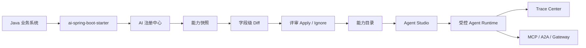

<p align="center">
  
</p>

<h1 align="center">Enterprise Agent Framework</h1>

<p align="center">
  <strong>让 Java 企业系统，像注册服务一样注册 AI 能力。</strong>
</p>

<p align="center">
  <a href="https://openjdk.org/projects/jdk/17/"></a>
  <a href="https://spring.io/projects/spring-boot"></a>
  <a href="https://spring.io/projects/spring-ai"></a>
  <a href="https://vuejs.org/"></a>
  <a href="LICENSE"></a>
</p>

Enterprise Agent Framework 是面向 Java / Spring Boot 企业系统的 AI 能力注册、治理与 Agent 编排平台。它不要求你把业务系统重写成新的 AI 应用，而是让已有接口、领域能力、知识库和业务流程，以 SDK 注册的方式进入一个可编排、可治理、可审计、可开放的 AI 中台。

> 推荐新系统和核心系统使用 `ai-spring-boot-starter` 主动注册；平台侧扫描保留给存量系统和低改造场景。


## 为什么做这个项目

企业 AI 落地真正难的不是“接一个大模型”，而是让模型安全、稳定、可控地调用企业能力：

- 哪些接口可以被 Agent 调用，哪些必须审批？
- 同名 Tool、同名能力、不同项目和环境之间如何隔离？
- 能力参数变化后，怎么知道影响了哪些 Agent？
- 业务系统上线、下线、扩容后，AI 平台如何感知实例状态？
- MCP、A2A、Gateway、Trace、ACL、限流、人工确认如何放进同一条生产链路？

EAF 把这些问题收敛成一套 Java 原生基础设施：业务系统注册能力，平台治理能力，Agent Studio 编排能力，运行时安全调用能力。

## 核心体验

### 1. SDK 注册优先

业务系统引入 Starter 后，启动时自动注册项目、实例和能力快照。你只需要用 Java 注解补充业务语义：

```java
@AiCapability(
    name = "queryContract",
    title = "查询合同",
    description = "按合同编号查询合同基础信息和审批状态",
    domain = "contract",
    module = "contract-query",
    tags = {"合同", "审批"},
    sideEffect = SideEffectLevel.READ_ONLY
)
@GetMapping("/contracts/{contractNo}")
public ContractDTO queryContract(
    @AiParam(description = "合同编号", required = true, example = "HT-2026-0001")
    @PathVariable String contractNo
) {
    return contractService.query(contractNo);
}
```

```yaml
eaf:
  registry:
    url: http://localhost:8603
    app-key: contract-center
    app-secret: change-me
    heartbeat-interval-ms: 30000
  project:
    code: contract-center
    name: 合同中心
    base-url: http://contract-center:8080
    environment: prod
    visibility: PROJECT
  capability:
    scan-controller: true
    sync-on-startup: true
```

启动后，EAF 会自动完成：

- 注册业务项目与运行实例
- 上报实例心跳、版本、host、port、SDK 版本
- 读取 Spring MVC Mapping、`@AiCapability`、`@AiParam`
- 生成能力快照和字段级 diff
- 进入评审流后再 apply 到正式能力目录
- 使用 HMAC 签名保护注册、心跳和同步请求

### 2. 能力先治理，再编排

SDK 上报不是简单覆盖生产 Tool。每次变更都会形成快照和 diff，平台可以逐条评审、应用或忽略，让能力变更有迹可循。



### 3. 存量系统仍可扫描接入

如果历史系统暂时无法改造，仍然可以通过平台侧 OpenAPI / Controller / DTO 扫描生成 Tool。扫描能力是迁移起点，不是唯一主线：当系统进入长期运营，建议逐步切换为 SDK 注册，让业务语义、权限建议、副作用等级和参数说明都回到代码侧维护。

## 你能用它做什么

| 场景 | 价值 |
| --- | --- |
| 企业 AI 中台 | 统一管理项目、能力、Agent、知识、模型、协议和治理策略 |
| Java 系统 AI 化 | 让 Spring Boot 接口和领域方法逐步变成 Agent 可调用能力 |
| Agent Studio | 通过可视化画布编排 Tool、Capability、Knowledge 和多步业务流 |
| 生产治理 | 引入 ACL、副作用等级、限流、Trace、审计、人工确认和回滚 |
| 能力开放 | 通过 MCP / A2A / Gateway 把企业能力开放给 IDE、外部 Agent 和业务系统 |
| RAG 与模型网关 | 管理知识库、向量检索、多模型 Provider 和 OpenAI 兼容代理 |

## 平台能力一览

| 能力 | 说明 |
| --- | --- |
| AI 注册中心 | 项目注册、实例心跳、能力同步、快照评审、稳定引用、项目隔离 |
| SDK 接入 | `ai-spring-boot-starter` 自动注册 Spring Boot 应用能力 |
| 能力目录 | 支持 Tool、SubAgent Capability、Interactive Form Capability、Augmented Tool |
| Agent Studio | 画布编排、调试、发布、版本快照、灰度和回滚 |
| Tool Runtime | 动态 HTTP Tool、语义检索、参数 Schema、调用日志 |
| 治理护栏 | Tool ACL、副作用等级、IRREVERSIBLE 闸口、限流、Preflight、Trace Center |
| 开放协议 | MCP JSON-RPC、A2A AgentCard / JSON-RPC、AI Gateway |
| 知识与检索 | 文档入库、Milvus 向量检索、业务索引、知识标签 |
| 模型网关 | 多 Provider 路由、Chat / Embedding、OpenAI 兼容代理 |
| 接口图谱 | API、字段、DTO、模块关系图谱，辅助 Agent 参数理解和影响分析 |

## 产品截图

| Agent Studio 与治理 | 能力与接口资产 |
| --- | --- |
|  |  |
| |  |

## 快速开始

### 1. 克隆项目

```bash
git clone https://github.com/w8123/EnterpriseAgentFramework.git
cd EnterpriseAgentFramework
```

### 2. 启动基础设施

```bash
docker compose -f deploy/docker-compose.infra.yml up -d
```

基础设施包含 MySQL、Redis、Milvus、Nacos 等。

### 3. 初始化数据库

```bash
mysql -h localhost -u root -proot < sql/init.sql
```

### 4. 构建后端

```bash
mvn clean install -DskipTests
```

### 5. 启动服务

```bash
# 模型网关，默认 8601
cd ai-model-service
mvn spring-boot:run

# RAG、知识库与扫描基础能力，默认 8602
cd ../ai-skills-service
mvn spring-boot:run

# Agent 编排、AI 注册中心、治理与开放协议，默认 8603
cd ../ai-agent-service
mvn spring-boot:run
```

### 6. 启动管理端

```bash
cd ai-admin-front
npm install
npm run dev
```

访问 [http://localhost:3000](http://localhost:3000)。

## 模块结构

| 模块 | 说明 | 默认端口 |
| --- | --- | --- |
| `ai-skill-sdk` | 能力声明注解与 Tool / Capability 开发契约 | - |
| `ai-spring-boot-starter` | 业务系统接入 SDK，支持注册、心跳、能力同步和 `EafAgentClient` | - |
| `ai-agent-service` | Agent 编排、AI 注册中心、治理、MCP、A2A、Gateway、Trace | 8603 |
| `ai-skills-service` | RAG、知识库、向量检索、扫描与语义上下文采集 | 8602 |
| `ai-model-service` | 统一模型网关、Embedding、OpenAI 兼容代理 | 8601 |
| `ai-common` | 公共 DTO、异常、配置 | - |
| `ai-admin-front` | Vue 3 管理端 | 3000 |
| `deploy` | Docker Compose、Kubernetes、Dockerfile | - |
| `docs` | 架构设计、路线图和阶段验收文档 | - |

```text
EnterpriseAgentFramework/
├─ ai-skill-sdk/             能力声明与 SDK 契约
├─ ai-spring-boot-starter/   Spring Boot 主动注册 Starter
├─ ai-agent-service/         Agent、注册中心、治理、开放协议
├─ ai-skills-service/        RAG、知识、扫描、语义基础层
├─ ai-model-service/         模型网关
├─ ai-admin-front/           管理端
├─ deploy/                   部署配置
├─ sql/                      聚合初始化脚本
└─ docs/                     设计与产品文档
```

## 技术栈

| 层级 | 技术 |
| --- | --- |
| 后端 | Java 17、Spring Boot 3.4、Spring Cloud 2024、Spring Cloud Alibaba |
| AI | Spring AI 1.0、Spring AI Alibaba、AgentScope |
| 数据 | MySQL 8、Redis 7、Milvus 2.4 |
| ORM | MyBatis-Plus |
| 文档与扫描 | JavaParser、Apache POI、PDFBox |
| 前端 | Vue 3、Vite 6、Element Plus、TypeScript、Pinia、Vue Flow、AntV G6 |
| 部署 | Docker、Kubernetes |

## 设计原则

1. **注册优先**：核心系统走 SDK 主动注册，扫描保留给存量系统。
2. **治理前置**：能力进入 Agent Studio 前，先明确项目边界、可见性、ACL、副作用和稳定引用。
3. **变更可审计**：能力同步进入快照、diff、评审、apply 流程，而不是直接覆盖生产配置。
4. **Java 原生**：面向 Spring / Java 企业团队，不要求业务团队迁移到 Python 技术栈。
5. **渐进生产化**：从一个接口开始，到能力目录、Agent 编排、开放协议、治理审计逐步演进。

## 路线图

- 更完整的注册中心凭证轮换、吊销、白名单与审计事件
- 租户、环境、项目级隔离策略增强
- 可配置限流、熔断、HITL 和统一 GuardRuntime
- Trace Center 聚合成本、风险、治理决策和调用时间线
- CLI、MCP stdio 桥、接入诊断和能力市场产品化

## 文档导航

| 文档 | 内容 |
| --- | --- |
| [AI 注册中心企业级改造设计](docs/AI注册中心企业级改造设计.md) | 注册中心、项目隔离、Starter 主动注册、评审流 |
| [AiCapability 能力声明与扫描入库设计](docs/AiCapability能力声明与扫描入库设计.md) | `@AiCapability`、`@AiParam`、语义来源和扫描策略 |
| [企业 Agent 开发与 Java 业务融合定位](docs/企业Agent开发与Java业务融合定位.md) | Java 业务系统接入 Agent 的整体定位 |
| [产品演进路线](docs/产品演进路线-Skill-AgentStudio-护栏.md) | Capability、Agent Studio、护栏与 Trace 的阶段路线 |
| [Phase3.0 Agent Studio](docs/Phase3.0-AgentStudio-落地验收清单.md) | 画布编排、版本快照、灰度、回滚与调试链路 |
| [Phase3.1 Tool ACL](docs/Phase3.1-ToolACL-落地验收清单.md) | Tool ACL、决策服务、运行时过滤与管理端页面 |
| [Phase4.1 接口图谱智能反哺](docs/Phase4.1-接口图谱智能反哺设计.md) | API / FIELD / DTO / MODULE 图谱与参数提示 |
| [Phase4.2 生产护栏与 TraceCenter](docs/Phase4.2-生产护栏与TraceCenter设计.md) | GuardRuntime、RateLimit、Breaker、Preflight、Trace Center |

## 命名说明

- 产品语义中，“可编排的粗粒度单元”统一称为 **Capability / 能力**。
- 历史代码、接口和数据库中仍可能出现 `skill`、`skills`、`skill_draft` 等命名，这是 legacy storage/API naming。
- `ai-skills-service` 主要承载知识检索、扫描与语义基础能力，模块名暂不强制 rename。

## 参与贡献

欢迎通过 Issue 反馈企业 AI 落地场景、使用问题和改进建议，也欢迎提交 Pull Request。贡献前可以先阅读 [CONTRIBUTING.md](CONTRIBUTING.md)。

## 交流

- 如果你也在做 Java + AI、企业 AI 中台、Agent 治理平台，欢迎交流。
- QQ 群：1073839193

## 开源协议

本项目基于 [MIT License](LICENSE) 开源。

