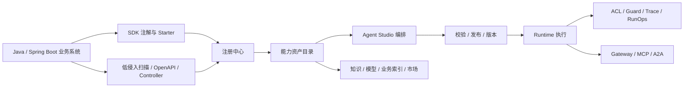

# 睿池 ReachAI 项目背景、技术与功能说明

> 本文基于当前仓库源码、`docs/` 知识库、`sql/init.sql`、前端路由和服务接口梳理，适合作为项目介绍、内部汇报或交接材料。

## 1. 项目定位

睿池 ReachAI 是一个面向 Java 企业系统的 AI Agent 开发与治理中台。它的目标不是只做一个聊天入口，也不是只把历史接口扫描成 Tool，而是把企业系统中已经存在的接口、领域方法、知识库、模型、流程、权限和运行审计，沉淀成 Agent 可以理解、编排、执行、治理和对外开放的 AI 能力资产。

从产品视角看，ReachAI 解决的是企业 AI 落地中经常被低估的一层问题：企业已有系统有大量业务接口和领域逻辑，但这些能力进入 Agent 之前，需要补齐语义描述、参数契约、权限边界、副作用等级、版本治理、运行追踪、人工确认和开放协议。ReachAI 把这些能力从“可被代码调用”推进到“可被 Agent 安全调用、可被平台治理、可被外部协议复用”。

## 2. 背景与问题

企业系统接入大模型后，真正复杂的部分通常不在模型调用本身，而在模型和企业能力之间的生产边界：

- 业务接口能否被 Agent 调用，哪些接口必须限制角色、项目、环境或租户。
- 接口参数、返回值或业务语义变更后，哪些 Agent、流程和外部调用会受影响。
- AI 生成的工作流如何被保存、校验、发布、回滚、评测和追踪。
- 知识库、模型实例、业务索引、MCP、A2A、Gateway、Trace、ACL、Guard 如何放在同一条链路里。
- 存量系统不能大改，新系统又希望用 SDK 主动声明能力，两类接入方式需要统一进入平台治理。

因此当前项目的核心主线可以概括为：

## 3. 技术架构

### 后端技术栈

项目是一个 Maven 多模块工程，后端主栈包括：

- Java 17。
- Spring Boot 3.4.x。
- Spring AI 1.0 与 Spring AI Alibaba。
- Spring Cloud 2024。
- MyBatis-Plus 作为主要数据访问层。
- MySQL 作为核心业务库。
- Redis、Milvus 等作为基础设施配套。
- AgentScope 与 LangGraph4j 作为运行时和流程编排方向。
- Apache POI、PDFBox 等用于文档解析与知识入库。

### 前端技术栈

管理端位于 `ai-admin-front`，使用：

- Vue 3。
- Vite 6。
- TypeScript。
- Element Plus。
- Pinia。
- Vue Router。
- Vue Flow 与 AntV G6，用于 Agent Studio、图谱和画布类能力。
- Axios、marked、xlsx 等通用工具。

### 数据与部署

- `sql/init.sql` 是当前统一 SQL 基线，覆盖模型、知识、业务索引、注册中心、能力资产、Agent、Trace、治理、MCP、A2A、市场和调试会话等表。
- `deploy/` 提供 Docker Compose、Kubernetes 与 Dockerfile 等部署材料。
- 各服务通过独立 Spring Boot 应用运行，前端默认通过 Vite 开发服务访问。

## 4. 模块说明

| 模块 | 职责 |
| --- | --- |
| `reachai-capability-sdk` | 提供 JDK8 兼容的业务系统能力声明 SDK 契约，包括 `@ReachCapability`、`@ReachParam`、`@ReachOutput`、签名和 SDK 图声明。 |
| `reachai-spring-boot2-starter` | 面向 Spring Boot 2 业务系统的 JDK8 接入 Starter，负责能力扫描、注册、心跳、能力同步和 SDK 图同步。 |
| `ai-runtime-contract` | 中台内部 `AiTool`、`AiSkill`、`ToolRegistry` 等运行时契约。 |
| `ai-agent-service` | 平台核心服务，承载 Agent 管理、注册中心、能力资产、Agent Studio、Runtime、RunOps、Trace、ACL、MCP、A2A、市场与治理能力。 |
| `ai-skills-service` | 知识库、文档处理、RAG、业务索引、扫描器、向量化和检索辅助能力。 |
| `ai-model-service` | 模型实例管理、Chat、Embedding、Rerank 与 OpenAI 兼容代理。 |
| `ai-common` | 公共 DTO、异常、配置等基础代码。 |
| `ai-admin-front` | Vue 管理端，覆盖注册中心、Agent、能力、知识、模型、运行治理、开放协议和领域治理页面。 |
| `sql` | 数据库初始化与升级基线。 |
| `docs` | 当前项目知识库、架构说明和截图材料。 |

## 5. 当前已实现的核心功能

### 5.1 项目注册与能力接入

项目已经支持两类接入模式：

- 主动接入：业务系统引入 `reachai-spring-boot2-starter` 和 `reachai-capability-sdk`，通过注解和启动时扫描主动注册项目、实例、能力和 Agent 图。
- 低侵入接入：平台侧通过 OpenAPI、Controller、DTO、语义扫描等方式接入存量系统。

注册中心已经覆盖项目注册、实例心跳、实例上下线、能力同步、能力快照、字段级 diff、评审 apply、能力描述设置和 SDK Agent Graph 同步等链路。能力进入正式目录前，会先沉淀快照与差异记录，避免接口变化直接冲击生产 Agent。

### 5.2 能力资产与能力内核

项目正在从早期 `Skill` 命名逐步收敛到更清晰的 `Capability / 能力` 产品语义。当前代码中已经形成能力内核的雏形：

- `capability_module`：能力模块。
- `tool_asset`：原子工具能力。
- `composition_definition`：由多个节点和能力组成的组合能力。
- `interaction_definition`：面向用户输入、表单采集和人工交互的交互能力。
- `interaction_session` 与 `interaction_event`：交互挂起、恢复和事件记录。

后端提供 `/api/capabilities` 管理能力模块、模块工具、组合和交互；`/api/runtime/tools/{qualifiedName}/execute`、`/api/runtime/compositions/{qualifiedName}/execute` 和 `/api/runtime/interactions/{sessionId}/resume` 提供运行入口。前端已经有“能力、模块工具、组合、交互”等页面入口。

### 5.3 Agent 管理、Studio 与 GraphSpec

Agent 侧已经具备从定义、编排、调试到发布的基础闭环：

- Agent 定义管理：名称、描述、模式、模型实例、Runtime 类型、运行位置、工具引用、知识引用和可见性。
- Agent Studio：可视化画布、节点配置、工具配置、运行配置和 AI 辅助生成/编辑草稿。
- 统一 `GraphSpec`：用 `graph_spec_json` 承载运行语义，用 `canvas_json` 承载画布布局。
- AI 生成与局部编辑：`/api/agent/studio/generate-draft` 和 `/api/agent/studio/edit-draft`。
- 节点调试与整图调试：`/api/agent/studio/debug-node`、`/api/agent/studio/debug-run`。
- 发布校验与版本管理：Agent 版本、发布事件、回滚、评测数据集、评测运行和评测结果。

当前支持的图节点方向包括 LLM、Tool、Capability、HTTP、MCP、用户输入、参数提取、条件、循环、变量赋值、变量聚合、知识检索、知识写入、文档抽取、人工审批、代码节点和最终回答等。

### 5.4 Runtime 执行

运行时层通过 `AgentRuntimeAdapter` 屏蔽不同执行框架差异：

- `AgentScopeRuntimeAdapter` 支持自主型 Agent。
- `LangGraph4jRuntimeAdapter` 支持基于 `GraphSpec` 的工作流 Agent。
- Starter 侧提供嵌入式 Runtime 能力，支持业务系统本地执行与平台注册调度。
- 组合能力 Runtime 支持图执行、模板渲染、Tool 调用、嵌套组合、用户输入、交互挂起和恢复。
- 槽位填充能力支持从用户消息、上下文和 LLM 中抽取字段，服务交互式流程。

Runtime 不只是执行节点，还会和发布校验、运行配置、Trace、Guard、人工确认和调试会话形成闭环。

### 5.5 知识库、RAG 与业务索引

知识与上下文层已经覆盖：

- 知识库创建、更新、删除和配置管理。
- 文件入库、预览、解析、切片、重解析、删除和 chunk 管理。
- 向量化、检索测试、RAG 查询、混合检索、重排、直接返回阈值等配置。
- 标签、批量标签、问题、命中日志、运营看板和统计。
- 业务索引定义、记录写入、批量导入、重建和搜索。
- 知识库绑定模型实例，包括 embedding、rerank 和 LLM 模型实例。

这些能力为 Agent 提供企业内部可信上下文，而不是让 Agent 只依赖通用模型知识。

### 5.6 模型网关

`ai-model-service` 提供模型实例管理和统一调用入口：

- 模型实例 CRUD 与连通性测试。
- Chat、流式 Chat、Embedding、Rerank。
- OpenAI 兼容代理接口。
- 支持不同 provider、模型类型、workspace 等维度的配置隔离。

Agent、知识库和检索能力通过模型实例引用具体模型，降低模型供应商变化对上层业务的影响。

### 5.7 运行治理与可观测

治理层已经具备基础能力：

- Tool ACL：按角色、项目、目标能力、权限和启停状态控制可调用范围。
- Guard / Preflight：在发布或调用前检查能力边界、副作用等级、项目隔离和不可逆调用授权。
- Trace：记录 Agent 运行 span、Tool 调用、Guard 决策和版本快照。
- RunOps：查看近期 trace、运行详情、诊断、重放和对比。
- 可解释决策：ACL explain、Guard decision log、运行路径和节点输出帮助复盘问题。

这部分能力对应企业落地最关键的生产可控性。

### 5.8 对外开放协议

平台已经提供多种开放边界：

- Gateway：暴露可调用 Agent 和公开/共享能力目录。
- MCP：管理 Client、白名单、调用流水和接入向导。
- A2A：管理 AgentCard endpoint、调用日志、任务状态和会话监控。

这些能力让已治理的 Agent 和 Capability 可以被 IDE、外部 Agent、业务系统或其他协议客户端复用。

### 5.9 前端管理台

前端已经形成较完整的产品功能地图：

- Dashboard 概览。
- Agent 列表、编辑、调试、Studio、版本和 AgentOps。
- RunOps 运行中心与运行详情。
- 知识库、文件入库、文件详情、检索测试。
- 业务索引管理与索引详情。
- 模型实例与模型调试台。
- Tool、Tool 检索测试、能力内核、能力挖掘、槽位提取器、部门/人员字典和槽位日志。
- 注册中心项目管理、项目详情、能力变更评审和 Runtime 纳管。
- MCP 白名单、Client、调用监控和接入向导。
- A2A endpoint 与会话监控。
- Tool ACL、领域定义、领域归属画布和分类器测试。

## 6. 当前价值

当前项目已经具备一个企业 AI 能力平台的骨架和主要闭环：

- 对业务系统：提供 SDK 和低侵入扫描两种方式，把已有 Java 能力接入 AI 平台。
- 对平台治理：在能力进入 Agent 前建立快照、diff、评审、权限、可见性和副作用边界。
- 对 Agent 构建：提供 Agent Studio、GraphSpec、AI 草稿生成、AI 局部编辑、发布校验和版本管理。
- 对生产运行：提供 Runtime Adapter、Trace、RunOps、ACL、Guard、调试和重放能力。
- 对企业上下文：提供模型实例、知识库、业务索引和领域归属。
- 对外部生态：提供 Gateway、MCP、A2A 等开放接口。

这意味着 ReachAI 当前已经不只是一个“工作流编辑器”或“接口扫描工具”，而是在向企业 AI 能力治理平台演进：它关注从企业能力发现、资产化、编排、执行、治理到开放的完整生产链路。

## 7. 仍在推进的方向

根据当前代码和文档状态，后续仍需要继续补齐：

- 将 `Skill` legacy 命名进一步收敛到 `Capability / 能力`，同时保护已有表名、接口和兼容性。
- 强化 Guard Runtime，包括限流、熔断、人工确认、成本归集和跨协议统一策略。
- 完成能力内核从资产管理到生产执行的完整产品化体验。
- 补齐端到端示例业务系统，例如合同中心、订单中心等，从 SDK 注册跑通到 Gateway / MCP 调用。
- 完善操作手册和演示脚本，让注册、评审、编排、发布、追踪、回放可以被稳定复现。
- 继续理清 `ai-agent-service` 与 `ai-skills-service` 在扫描、语义、RAG 和资产治理上的长期边界。

## 8. 一句话总结

睿池 ReachAI 是一个把 Java 企业系统能力转化为可治理、可编排、可运行、可追踪、可开放 AI 能力资产的平台；它让企业不是简单“接入大模型”，而是建立一套面向生产 Agent 的能力中台。
