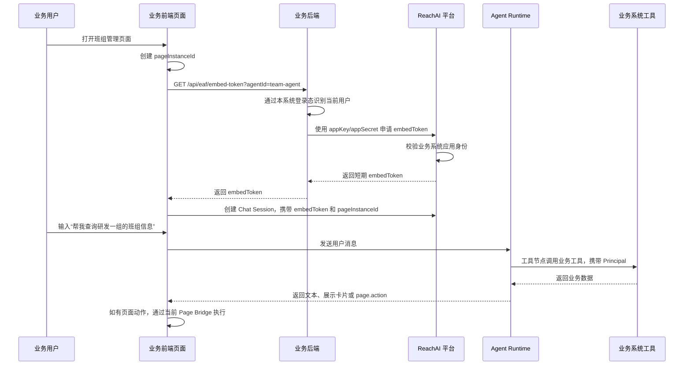

# 平台身份与授权模型

## 定位

平台身份与授权模型负责回答四个问题：

1. 哪个业务系统可信地接入了平台？
2. 当前使用智能体的业务用户是谁？
3. 智能体代表这个用户能调用哪些工具、触发哪些页面动作？
4. 多系统、多浏览器、多页面实例并存时，动作如何只落到正确的当前页面？

这套模型不要求 ReachAI 成为企业 IAM，也不要求各业务系统的登录 token 互认。更合理的边界是：企业 IAM 或业务系统继续负责原始登录，业务后端负责识别当前用户，ReachAI 通过系统级凭证和短期用户会话 token 接收可信身份上下文。

一句话概括：

> 项目注册解决“哪个系统接入了平台”；embedToken 解决“这个系统里的哪个用户正在使用智能体”；稳定用户 ID 解决“多系统里是不是同一个人”。

## 当前已落地

当前系统已经具备业务系统接入的基础，但还没有完整的嵌入式对话身份链路。

### 已有能力

- `reachai-spring-boot2-starter` 支持通过 `reachai.registry`、`reachai.project`、`reachai.capability` 主动注册业务项目、心跳和能力。
- `EafRegistryClient` 已经支持 `X-EAF-App-Key`、`X-EAF-Timestamp`、`X-EAF-Nonce`、`X-EAF-Signature` 的 HMAC 签名请求。
- `registry_project_credential` 表已经具备 `project_code`、`app_key`、`app_secret`、`status`、`expires_at` 等字段。
- `RegistrySecurityService` 已经能按项目凭证校验注册中心请求签名。
- `tool_acl`、`guard_decision_log`、`tool_call_log`、`agent_trace_span` 已经提供了运行治理和审计的基础。

### 尚未补齐

- 业务前端嵌入对话框的短期 `embedToken` 签发与校验。
- 当前业务用户身份抽象，例如 `EafCurrentUserProvider`。
- Chat Session 与 `tenantId/appId/userId/pageInstanceId` 的绑定。
- 工具调用时透传用户上下文。
- 页面动作只回到当前页面实例的路由机制。
- 业务前端 `origin` 白名单和嵌入授权策略。
- 平台管理员、业务系统应用身份、业务终端用户身份的清晰分层。
- 平台自身的用户表、登录会话、身份提供方配置和管理端 RBAC。

## 核心身份分层

平台里至少要区分三类身份，不能混在一起。

| 身份类型 | 代表谁 | 典型使用场景 | 凭证来源 |
| --- | --- | --- | --- |
| 平台管理员/设计者 | 使用 Agent Studio 的人 | 配置模型、工具、Agent、发布流程、查看审计 | 统一 Auth Provider，生产接 IAM，本地开发走 LOCAL 登录 |
| 业务系统应用身份 | 接入 ReachAI 的业务系统后端 | 项目注册、能力同步、申请 embedToken、服务端调用 Agent | `projectCode/appKey/appSecret` |
| 业务终端用户身份 | 业务系统里的当前登录用户 | 在业务页面嵌入对话框中使用智能体 | 业务后端从本系统登录态解析后委托给平台 |

平台管理用户和业务终端用户必须分开建模。平台管理用户用于登录 Agent Studio 和管理平台资产；业务终端用户来自业务系统，不要求在平台里维护密码，也不默认具备登录 Agent Studio 的能力。

## 平台用户与登录模型

ReachAI 需要有自己的管理端身份模型，但它不应该被设计成封闭的本地账号系统。目标设计是统一的 Auth Provider 抽象：

- 生产环境接企业 IAM，例如 OIDC、OAuth2、SAML 或企业统一网关。
- 本地开发、离线演示或 IAM 暂不可用时，启用 LOCAL Provider，使用平台本地账号密码登录。
- Agent Studio、项目注册管理、模型配置、凭证管理、审计查看等管理端操作统一走平台管理用户和平台 RBAC。
- 嵌入式对话框里的业务终端用户不直接使用平台登录态，而是走业务后端签发/申请的 `embedToken`。

### Auth Provider

Auth Provider 负责把外部登录结果转换为平台管理用户。

```text
IAM / OIDC / SSO / LOCAL
        |
        v
PlatformPrincipal
        |
        v
platform_user + platform_role + platform_permission
```

建议抽象：

```java
public interface PlatformAuthProvider {
    PlatformLoginResult authenticate(PlatformLoginRequest request);
    PlatformUserProfile loadProfile(String subject);
}
```

不同 Provider 的职责：

| Provider | 用途 | 说明 |
| --- | --- | --- |
| `OIDC` | 企业 IAM / SSO | 生产推荐，平台校验 ID Token 或走授权码流程。 |
| `SAML` | 传统企业 SSO | 如公司现有 IAM 使用 SAML，可作为适配 Provider。 |
| `HEADER` | 网关注入身份 | 如果统一网关已完成认证，平台只信任网关注入的用户头。 |
| `LOCAL` | 本地开发、离线演示 | 使用平台本地用户和密码，不依赖 IAM。 |

### 平台管理用户

平台管理用户代表“谁在管理 ReachAI”，不是“谁在业务页面里和智能体对话”。

建议数据模型：

```text
platform_user
- id
- username
- display_name
- email
- mobile
- status
- source_provider
- external_subject
- last_login_at
- created_at
- updated_at

platform_role
- id
- role_code
- role_name
- description
- status
- created_at
- updated_at

platform_user_role
- id
- user_id
- role_id
- scope_type
- scope_value
- created_at

platform_permission
- id
- permission_code
- permission_name
- resource_type
- action
- description

platform_role_permission
- id
- role_id
- permission_id
```

`source_provider + external_subject` 用于把 IAM 用户和平台用户绑定。例如：

```text
source_provider = OIDC
external_subject = iam-user-123
username = zhangsan
```

LOCAL Provider 下：

```text
source_provider = LOCAL
external_subject = local:admin
username = admin
```

### 平台登录会话

平台管理端登录成功后，平台签发自己的管理端访问 token 或 session。这个 token 只用于 Agent Studio 和管理端 API，不用于业务页面嵌入对话。

建议数据模型：

```text
platform_login_session
- id
- session_id
- user_id
- provider
- access_token_id
- refresh_token_id
- ip
- user_agent
- expires_at
- revoked_at
- created_at
```

管理端 token 建议使用 JWT + refresh token，或服务端 session。无论哪种方式，权限判断都应回到平台用户和角色。

### 本地开发登录

本地开发应允许断开 IAM，使用 LOCAL Provider：

```yaml
eaf:
  auth:
    provider: LOCAL
    local:
      enabled: true
      bootstrap-admin:
        username: admin
        password: admin123
```

生产环境切换为 IAM：

```yaml
eaf:
  auth:
    provider: OIDC
    oidc:
      issuer-uri: https://iam.example.com
      client-id: reachai
      client-secret: ${REACHAI_OIDC_CLIENT_SECRET}
```

LOCAL Provider 不是临时后门，而是 Auth Provider 的一种实现。生产环境可以禁用 LOCAL 登录，只允许 IAM。

### 管理端 RBAC

平台管理端至少需要以下角色：

| 角色 | 典型权限 |
| --- | --- |
| `PLATFORM_ADMIN` | 系统配置、模型实例、项目凭证、用户角色、全局审计 |
| `AGENT_DESIGNER` | 创建和编辑 Agent、工作流、节点配置 |
| `PROJECT_OWNER` | 管理自己负责的业务项目、能力同步、项目内 Agent |
| `OPERATOR` | 查看运行记录、调试、回放、处理运行问题 |
| `AUDITOR` | 只读查看审计日志、Trace、权限决策 |

管理端 RBAC 控制的是平台资产管理行为。业务终端用户的 Tool ACL 和数据权限仍通过运行时 Principal、业务角色和业务系统后端共同决定。

## 关键概念

### Project / App

`projectCode` 是业务系统在平台里的稳定编码，例如 `bzsdk`。它目前已经用于项目注册、能力归属、工具隔离和 Agent 归属。

嵌入对话场景中直接复用 `projectCode` 作为 `appId`。这样业务系统、能力归属、工具 ACL、Agent 归属和嵌入授权都围绕同一个稳定编码展开，避免同时维护两套应用标识。

```text
appId = projectCode
```

如果未来一个业务项目下确实需要多个前端应用差异化授权，可以在 `projectCode` 下增加 `clientKey` 或 `frontendKey`，但不改变 `appId = projectCode` 的主模型。

### App Credential

应用凭证证明“请求来自可信业务后端”，不是证明“当前用户是谁”。

已有字段可以继续使用：

```text
project_code
app_key
app_secret
status
expires_at
```

业务系统后端用 `appKey/appSecret` 与平台进行服务端到服务端交互，例如注册能力、申请 `embedToken`。

### Principal

`Principal` 表示平台运行时看到的“当前业务用户”。它来自业务后端，不来自浏览器自报。

建议结构：

```json
{
  "tenantId": "default",
  "appId": "bzsdk",
  "externalUserId": "ADMIN001",
  "globalUserId": "emp-0001",
  "userName": "系统管理员",
  "deptId": "研发中心",
  "roles": ["admin"],
  "attributes": {
    "orgId": "org-001"
  }
}
```

字段说明：

| 字段 | 说明 |
| --- | --- |
| `tenantId` | 租户或企业空间。单租户阶段可固定为 `default`。 |
| `appId` | 业务系统编码，等同 `projectCode`。 |
| `externalUserId` | 业务系统内的用户 ID，建议优先使用工号。 |
| `globalUserId` | 跨系统统一用户 ID，可后续接 IAM 或映射表。 |
| `roles` | 业务系统传递的平台可理解角色，用于 Tool ACL、Agent ACL。 |
| `attributes` | 部门、组织、岗位等扩展属性。 |

### Embed Token

`embedToken` 是给业务前端对话框使用的短期用户会话凭证。它不是按系统长期下发，而是按“某个系统里的某个用户的一次智能体会话”下发。

`embedToken` 由 ReachAI 平台统一签发，业务后端不能本地自签。业务后端只能使用 `projectCode/appKey/appSecret` 和当前用户上下文向平台申请 token。

token 格式使用 JWT，便于 Chat Embed SDK、平台网关和运行时服务传递与校验。JWT 中只放必要身份和会话声明，不放敏感业务数据。

它应该绑定：

```text
tenantId + appId + agentId + externalUserId + pageInstanceId + origin + expiresAt
```

推荐有效期：

- 默认 5 到 15 分钟。
- SDK 在即将过期时通过 `tokenProvider()` 重新获取。
- token 泄露后的影响窗口要尽量短。

建议 JWT claims：

```json
{
  "iss": "reachai",
  "aud": "reachai-chat-embed",
  "tenantId": "default",
  "appId": "bzsdk",
  "projectCode": "bzsdk",
  "agentId": "team-agent",
  "externalUserId": "ADMIN001",
  "globalUserId": "ADMIN001",
  "roles": ["admin"],
  "pageInstanceId": "page-uuid-001",
  "origin": "http://localhost:5173",
  "iat": 1710000000,
  "exp": 1710000600
}
```

### Page Instance

`pageInstanceId` 表示当前浏览器里打开的某一个业务页面实例。

同一个用户可能打开多个“班组管理”页面，每个页面都必须有不同的 `pageInstanceId`。页面动作必须只返回到当前对话框绑定的页面实例，不能广播到所有相同路由的页面。

### Chat Session

Chat Session 表示一次对话上下文，应该绑定：

```text
sessionId
tenantId
appId
agentId
externalUserId/globalUserId
pageInstanceId
route
origin
createdAt
expiresAt
```

## 总体链路



## SDK 扩展点设计

### 当前用户提供器

后端 SDK 应提供一个扩展点，由业务系统实现“当前请求的用户是谁”。

```java
public interface EafCurrentUserProvider {
    EafUser currentUser();
}
```

业务系统实现示例：

```java
@Component
public class BanzhuEafCurrentUserProvider implements EafCurrentUserProvider {
    @Override
    public EafUser currentUser() {
        SecurityUser userInfo = BaseSecurityUtil.getUser();
        return EafUser.builder()
                .userId(userInfo.getEmpNo())
                .userName(userInfo.getUserName())
                .deptId(userInfo.getDeptId())
                .roles(userInfo.getRoles())
                .build();
    }
}
```

这样 SDK 不需要绑定 Spring Security、Sa-Token、Shiro 或业务系统自研安全框架。

### Embed Token 服务

后端 SDK 可以提供默认 Controller 或 Service：

```java
@GetMapping("/api/eaf/embed-token")
public EafEmbedTokenResponse embedToken(EafEmbedTokenRequest request) {
    return eafEmbedTokenService.issueToken(request);
}
```

内部流程：

1. 调用 `EafCurrentUserProvider.currentUser()` 获取当前业务用户。
2. 读取 `reachai.project.code`、`reachai.registry.appKey`、`reachai.registry.appSecret`。
3. 带上 `agentId`、`route`、`pageInstanceId`、`origin` 向平台申请短期 `embedToken`。
4. 返回给业务前端的 Chat Embed SDK。

### 服务端主动调用 Agent

如果业务后端主动调用平台智能体，也应该复用同一个 `EafCurrentUserProvider`。

```java
agentClient.run("team-agent", input);
```

SDK 自动附加：

```json
{
  "principal": {
    "appId": "bzsdk",
    "externalUserId": "ADMIN001",
    "roles": ["admin"]
  }
}
```

### 业务用户同步 SDK

业务系统应能够通过后端 SDK 主动向平台同步业务终端用户信息。这个同步不用于平台登录，而是用于智能体权限、用户映射、审计检索和跨系统身份关联。

SDK 建议提供：

```java
public interface EafIdentityClient {
    EafUserSyncResult upsertUser(EafExternalUser user);
    EafUserSyncResult disableUser(String externalUserId);
    EafUserSyncResult deleteUser(String externalUserId);
    EafBatchUserSyncResult syncUsers(List<EafExternalUser> users);
}
```

业务系统调用示例：

```java
eafIdentityClient.upsertUser(EafExternalUser.builder()
        .globalUserId(user.getEmpNo())
        .externalUserId(user.getUserCode())
        .userName(user.getUserName())
        .email(user.getEmail())
        .mobile(user.getMobile())
        .deptId(user.getDeptId())
        .deptName(user.getDeptName())
        .roles(user.getRoles())
        .build());
```

同步规则：

- `tenantId + globalUserId` 已存在时，更新平台业务用户主体。
- `tenantId + appId + externalUserId` 已存在时，更新业务系统绑定关系。
- `tenantId + globalUserId` 不存在时，创建平台业务用户主体。
- 同一个 `globalUserId` 可以绑定多个业务系统身份。
- 如果同一个人在某业务系统里的 `externalUserId` 发生变化，应新增绑定并保留旧绑定的历史状态，不能覆盖审计记录。
- 删除采用软删除，不做物理删除。

同步来源：

- 被动同步：业务用户申请 `embedToken` 时，平台顺便 upsert 当前用户。
- 主动同步：业务系统启动、定时任务或用户变更事件触发 SDK 批量同步。
- 手工维护：平台管理端可补录或修正跨系统用户映射，但不应成为主要来源。

### SDK Token 缓存边界

后端 SDK 可以缓存平台服务端 token，但不能把所有 token 都当成同一类。

| token 类型 | 是否缓存 | 说明 |
| --- | --- | --- |
| `appKey/appSecret` HMAC 签名 | 不需要缓存 | 每次请求按时间戳和 nonce 计算签名。 |
| 平台服务端 access token | 可以缓存 | 如果后续引入 client credentials，可按过期时间提前刷新。 |
| `embedToken` | 只做短生命周期缓存 | 绑定用户、Agent、页面实例，不做全局缓存。 |
| Chat SDK 前端 token | 当前页面会话内缓存 | 过期前通过 `tokenProvider()` 重新向业务后端获取。 |

SDK 缓存规则：

- 服务端 access token 按 `projectCode/appKey/scope` 维度缓存。
- 缓存项必须记录 `expiresAt`，并在过期前刷新。
- 刷新失败时不能继续使用已过期 token。
- 用户级 `embedToken` 绑定 `externalUserId/agentId/pageInstanceId/origin`，只允许当前会话使用。
- SDK 不应把业务用户的浏览器 token 缓存或转发给平台。

## 平台接口草案

### 申请 embedToken

业务后端调用平台：

```http
POST /api/embed/token/exchange
X-EAF-App-Key: bzsdk
X-EAF-Timestamp: 1710000000000
X-EAF-Nonce: uuid
X-EAF-Signature: hmac-sha256
Content-Type: application/json
```

请求体：

```json
{
  "projectCode": "bzsdk",
  "agentId": "team-agent",
  "pageInstanceId": "page-uuid-001",
  "route": "/team-management",
  "origin": "http://localhost:5173",
  "principal": {
    "externalUserId": "ADMIN001",
    "userName": "系统管理员",
    "roles": ["admin"],
    "deptId": "研发中心"
  }
}
```

响应：

```json
{
  "token": "eyJhbGciOiJIUzI1NiJ9...",
  "expiresIn": 600,
  "sessionHint": {
    "appId": "bzsdk",
    "agentId": "team-agent",
    "pageInstanceId": "page-uuid-001"
  }
}
```

### 创建 Chat Session

业务前端 Chat SDK 调用平台：

```http
POST /api/embed/chat/sessions
Authorization: Bearer <embedToken>
Content-Type: application/json
```

请求体：

```json
{
  "pageInstanceId": "page-uuid-001",
  "route": "/team-management",
  "bridgeActions": ["team.refreshList", "team.openDetail"]
}
```

响应：

```json
{
  "sessionId": "chat-session-001",
  "agentId": "team-agent",
  "principal": {
    "appId": "bzsdk",
    "externalUserId": "ADMIN001"
  }
}
```

### 发送消息

对话消息推荐使用 SSE：

```http
POST /api/embed/chat/sessions/{sessionId}/messages/stream
Authorization: Bearer <embedToken>
Content-Type: application/json
```

请求体：

```json
{
  "message": "帮我查询研发一组的班组信息"
}
```

服务端事件可包括：

```text
message.delta
message.completed
ui.requested
page.action.requested
tool.started
tool.completed
error
```

## 工具调用用户上下文

工具节点一般由平台运行时后端调用，不由业务前端页面直接调用。

平台调用业务工具时，应带上 Principal 和 Trace 信息。

示例请求头：

```http
X-ReachAI-Invocation-Token: <short-lived invocation JWT>
X-EAF-Project-Code: bzsdk
X-EAF-Agent-Id: team-agent
X-EAF-Trace-Id: trace-001
X-EAF-Session-Id: chat-session-001
X-EAF-User-Id: ADMIN001
X-EAF-Global-User-Id: emp-0001
X-EAF-Roles: admin
```

`X-EAF-*` 和 `X-ReachAI-*` 普通上下文头只用于日志、排障和兼容业务网关，业务系统不能只凭这些普通 header 放行业务接口。ReachAI 平台调用 SDK 暴露的 `REACHAI_CAPABILITY_HTTP` 能力时，必须同时带 `X-ReachAI-Invocation-Token`。

`invocationToken` 是平台为单次业务能力调用签发的短期 JWT，第一版使用该项目 `registry_project_credential.appSecret` 做 HMAC 签名，默认有效期 1 到 2 分钟。token 至少绑定：

```text
projectCode + appKey + capabilityName + externalUserId + agentId + sessionId + traceId + expiresAt
```

业务系统侧 `reachai-spring-boot2-starter` 校验 token 后，恢复 `ReachAiInvocationContext`。业务代码可以直接读取该上下文，也可以通过 `ReachAiSecurityContextBridge` 把委托用户临时桥接到 Sa-Token、Spring Security、Shiro 或自研安全上下文。

业务后端收到工具调用后，仍应按自己的业务权限体系做最终校验。

权限边界：

| 层级 | 负责内容 |
| --- | --- |
| IAM | 原始登录身份 |
| 业务系统后端 | 识别当前用户、业务数据权限、数据行级权限 |
| ReachAI 平台 | Agent 权限、Tool ACL、运行护栏、审计 |
| Chat Embed SDK | 当前页面会话、页面动作确认、前端动作执行结果 |

## 页面动作路由

页面动作不是工具调用。它不应该直接改业务数据，而是让当前页面执行 UI 行为，例如：

- 填充查询条件。
- 刷新列表。
- 打开详情弹窗。
- 滚动定位。
- 高亮某条记录。

页面动作必须只投递给当前 `pageInstanceId`。

```json
{
  "type": "page.action.requested",
  "target": {
    "pageInstanceId": "page-uuid-001"
  },
  "actionKey": "team.openDetail",
  "args": {
    "teamName": "研发一组"
  }
}
```

业务页面注册动作：

```ts
bridge.registerAction('team.openDetail', async (args) => {
  // 当前页面自己打开详情
})
```

如果当前页面没有注册该动作，应返回：

```json
{
  "type": "page.action.result",
  "status": "ACTION_NOT_FOUND",
  "actionKey": "team.openDetail"
}
```

## 多系统用户关联

平台需要维护一份“业务用户目录”，但它不是平台登录账号表，也不是替代企业 IAM 的用户中心。它的职责是让 ReachAI 能识别、授权、审计和关联业务系统里的使用者。

业务用户目录由两层组成：

```text
业务用户主体：tenantId + globalUserId
外部身份绑定：tenantId + appId + externalUserId
```

`globalUserId` 优先使用企业 IAM 的统一用户 ID 或工号。`externalUserId` 是某个业务系统内部的用户 ID。

一个业务用户主体可以绑定多个业务系统身份：

```text
tenantId | globalUserId | appId | externalUserId
default  | emp-0001     | bzsdk | ADMIN001
default  | emp-0001     | oa    | zhangsan
default  | emp-0001     | crm   | 10086
```

平台通过以下方式维护这份目录：

- 业务系统申请 `embedToken` 时，被动 upsert 当前用户。
- 业务系统通过 SDK 主动批量同步用户。
- 平台管理端可人工修正跨系统映射。

upsert 规则：

- 如果 `tenantId + globalUserId` 已存在，更新业务用户主体资料。
- 如果 `tenantId + appId + externalUserId` 已存在，更新该业务系统绑定资料。
- 如果用户主体存在但绑定不存在，新增绑定。
- 如果用户主体和绑定都不存在，创建用户主体并创建绑定。

删除规则：

- 业务用户和外部绑定都采用软删除。
- `DISABLED` 表示禁用，不允许继续使用智能体。
- `DELETED` 表示业务系统已删除或用户离职，历史审计仍保留。
- 不做物理删除，避免历史 Trace、Tool 调用和审计记录无法解释。

全局用户中心不应阻塞嵌入式对话链路，但 token、session、Trace 和工具调用日志中必须保留 `externalUserId`、`globalUserId` 两个位置，避免后续迁移困难。

## 权限决策模型

一次嵌入式对话至少经过以下授权判断。

| 阶段 | 判断 | 拒绝后行为 |
| --- | --- | --- |
| 申请 embedToken | `projectCode/appKey/appSecret` 是否有效 | 返回 401/403 |
| 申请 embedToken | `origin` 是否在白名单 | 返回 403 |
| 申请 embedToken | 该业务系统是否允许访问指定 Agent | 返回 403 |
| 创建 Chat Session | token 是否有效、是否过期 | 返回 401 |
| 运行 Agent | 当前用户角色是否可运行该 Agent | 返回权限错误 |
| 装配 Tool | Tool ACL 是否允许该角色看到工具 | 工具不进入 LLM 可见列表 |
| 调用 Tool | Guard 是否允许调用 | 记录拒绝原因 |
| 业务工具执行 | 业务系统是否允许该用户访问数据 | 业务系统返回业务权限错误 |
| 页面动作 | 当前页面是否注册 actionKey | 返回 `ACTION_NOT_FOUND` |
| 页面动作 | 是否需要用户确认 | 前端确认后执行 |

## 数据模型建议

### 平台用户与登录

平台管理端需要独立的用户、角色、权限和登录会话表。它们服务 Agent Studio 和管理端 API，不服务业务页面里的终端用户登录。

```text
platform_user
platform_role
platform_user_role
platform_permission
platform_role_permission
platform_login_session
platform_auth_provider
```

`platform_auth_provider` 保存 IAM/OIDC/SAML/HEADER/LOCAL 等身份提供方配置。LOCAL Provider 用于本地开发和离线演示；生产环境可以禁用 LOCAL，只允许企业 IAM。

### app credential 扩展

可在现有 `registry_project_credential` 基础上扩展：

```sql
allowed_origins_json  TEXT
allowed_agent_ids_json TEXT
token_ttl_seconds INT
```

也可以新增独立表管理嵌入配置。

### embed app policy

```text
eaf_embed_app_policy
- id
- project_code
- app_key
- allowed_origins_json
- allowed_agent_ids_json
- default_token_ttl_seconds
- status
- created_at
- updated_at
```

### embed session

```text
eaf_embed_session
- id
- session_id
- tenant_id
- app_id
- project_code
- agent_id
- external_user_id
- global_user_id
- page_instance_id
- route
- origin
- status
- expires_at
- created_at
- updated_at
```

`eaf_embed_session` 的作用是把一次嵌入式对话和 `tenantId/appId/agentId/externalUserId/pageInstanceId/origin` 固化下来。它和 Trace 不完全等价：Trace 记录一次运行过程，embed session 记录对话会话和页面绑定关系。是否必须作为独立表落库，仍需单独讨论。

### 业务用户目录与外部身份绑定

```text
eaf_business_user
- id
- tenant_id
- global_user_id
- display_name
- email
- mobile
- status
- source
- last_seen_at
- created_at
- updated_at
```

`eaf_business_user` 是平台可识别的业务终端用户主体。它不保存密码，不用于登录 Agent Studio。

```text
eaf_external_user_binding
- id
- tenant_id
- business_user_id
- app_id
- external_user_id
- external_user_name
- dept_id
- dept_name
- status
- last_seen_at
- created_at
- updated_at
```

`eaf_external_user_binding` 记录某个业务系统中的用户身份绑定。一个 `business_user_id` 可以对应多个业务系统绑定。

```text
eaf_external_user_role_binding
- id
- tenant_id
- business_user_id
- app_id
- external_user_id
- role_code
- role_name
- source
- status
- created_at
- updated_at
```

`eaf_external_user_role_binding` 记录业务系统同步过来的角色、岗位或用户组。它可以参与 Tool ACL 的角色来源讨论，但最终角色映射策略仍需单独定稿。

唯一约束建议：

```text
uk_business_user_global: tenant_id + global_user_id
uk_external_binding: tenant_id + app_id + external_user_id
```

外部用户绑定表用于跨系统识别同一个人。即使暂时不做人工维护界面，运行日志和 session 也必须保留 `externalUserId` 与 `globalUserId` 字段。

## 审计要求

所有嵌入式智能体调用应至少记录：

- `traceId`
- `sessionId`
- `tenantId`
- `appId/projectCode`
- `agentId`
- `externalUserId/globalUserId`
- `pageInstanceId`
- 用户输入
- 工具调用列表
- 页面动作列表
- 权限拒绝原因
- 错误信息

审计目标不是只看技术错误，还要能回答：

> 谁在什么系统、什么页面、以什么身份，让智能体调用了什么工具、查看了什么数据、触发了什么页面动作？

## 安全原则

1. 前端不能自报用户身份。
2. 平台不直接信任各业务系统浏览器 token。
3. 平台信任已注册业务后端的签名请求。
4. `embedToken` 必须短期有效。
5. `origin` 必须校验，避免任意网站嵌入对话框。
6. 页面动作默认只作用于当前 `pageInstanceId`。
7. 工具调用必须携带用户上下文，但业务后端仍要做最终数据权限校验。
8. 高风险页面动作需要用户确认。
9. token、appSecret 不应出现在浏览器可读配置里。
10. 所有权限拒绝必须进入审计日志。

## 与 Agent Studio 的关系

Agent Studio 是设计和调试入口，不是最终业务用户的运行入口。

运行态：

- 用户在业务系统页面内使用嵌入式对话框。
- Chat Embed SDK 绑定当前页面的 Page Bridge。
- 页面动作直接回到当前页面实例。

调试态：

- Agent Studio 可以显示页面动作请求卡片。
- Studio 调试会话只能操作显式绑定的一个测试页面实例。
- 未绑定业务页面时，页面动作只展示请求，不应广播给任何业务页面。

## 目标落地范围

身份与授权模型按完整目标架构设计，不按临时过渡方案拆分。落地时可以分任务实施，但代码和表结构应朝同一个目标收敛。

目标范围包括：

- 平台管理端登录：统一 Auth Provider，支持 IAM/OIDC/SAML/HEADER/LOCAL。
- 平台管理端 RBAC：平台用户、角色、权限、项目作用域和审计权限。
- 业务系统应用身份：复用 `projectCode` 作为 `appId`，使用 `appKey/appSecret` 证明业务后端身份。
- 嵌入式对话身份：平台统一签发 JWT 格式 `embedToken`。
- 当前用户扩展点：后端 SDK 提供 `EafCurrentUserProvider`，由业务系统返回当前登录用户。
- Chat Session：绑定 `tenantId/appId/projectCode/agentId/externalUserId/pageInstanceId/origin`。
- 运行时 Principal：Agent Runtime、Tool ACL、Guard、Trace、Tool 调用统一使用同一个用户上下文。
- 工具调用上下文：平台调用业务工具时透传用户、角色、Trace、Session。
- 页面动作路由：页面动作只返回当前 `pageInstanceId`，不按 `actionKey` 广播。
- 业务用户目录：保存业务终端用户主体、外部身份绑定和业务角色绑定，支持 SDK upsert/disable/delete/sync。
- 外部用户映射：保留 `externalUserId/globalUserId`，支持跨系统识别同一人。
- SDK token 缓存：服务端 access token 可缓存，用户级 `embedToken` 只做短生命周期会话缓存。
- Chat Embed SDK：提供 npm SDK，同时打包 UMD script。
- Studio 调试态：当前只展示页面动作请求；“连接测试页面”不纳入当前目标范围。

## 接入示例

业务系统配置：

```yaml
reachai:
  registry:
    enabled: true
    url: http://localhost:18603
    app-key: bzsdk
    app-secret: ${REACHAI_APP_SECRET}
  project:
    code: bzsdk
    name: 班组SDK2
    base-url: http://127.0.0.1:18611
    environment: dev
    owner: JSH
    visibility: PRIVATE
  capability:
    scan-controller: true
    sync-on-startup: true
```

业务后端实现当前用户：

```java
@Component
public class BanzhuEafCurrentUserProvider implements EafCurrentUserProvider {
    @Override
    public EafUser currentUser() {
        SecurityUser userInfo = BaseSecurityUtil.getUser();
        return EafUser.builder()
                .userId(userInfo.getEmpNo())
                .userName(userInfo.getUserName())
                .roles(userInfo.getRoles())
                .deptId(userInfo.getDeptId())
                .build();
    }
}
```

业务前端：

```ts
const bridge = createPageBridge({
  appId: 'bzsdk',
  route: '/team-management',
})

bridge.registerAction('team.refreshList', async (args) => {
  // 当前页面刷新列表
})

bridge.registerAction('team.openDetail', async (args) => {
  // 当前页面打开详情
})

createEafChat({
  agentId: 'team-agent',
  mount: '#eaf-chat',
  bridge,
  tokenProvider: () => fetch('/api/eaf/embed-token?agentId=team-agent').then(r => r.text()),
})
```

## 需要避免的误区

- 不要让业务前端直接传 `userId/roles` 给平台作为可信身份。
- 不要把业务系统自己的浏览器 token 直接交给平台解析。
- 不要让页面动作按 `actionKey` 广播到所有打开的页面。
- 不要把页面动作当成工具调用；页面动作只处理 UI 行为。
- 不要让平台完全替代业务系统的数据权限判断。
- 不要把 Agent Studio 调试台当成最终用户运行入口。

## 待确认问题

以下问题仍需单独讨论后再定稿：

1. Tool ACL 的角色来源：直接使用业务系统传入角色，还是平台维护角色映射。
2. `eaf_embed_session` 是否必须作为独立会话表落库，还是可以先由现有 Trace 与运行会话结构承载。
