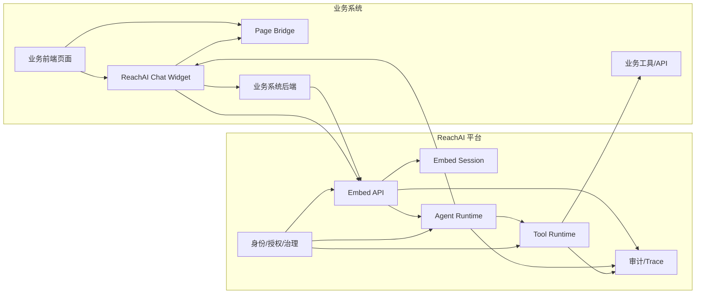

# 平台对话框对外嵌入支持

## 定位

平台对话框对外嵌入支持，是 ReachAI 从“平台内编排工具”走向“业务系统内智能协作”的核心能力。它允许业务系统在自己的页面中嵌入 ReachAI 提供的对话框，让业务用户在当前页面直接与智能体交互，并让智能体在授权范围内调用业务工具、展示结构化结果、触发当前页面动作。

这不是简单的聊天窗口，也不是把 Agent Studio 的调试台搬到业务系统。它是一套完整的企业级运行链路：

- 业务系统前端嵌入平台 Chat Widget。
- 业务系统后端基于本系统登录态向平台申请短期 `embedToken`。
- 平台用 `embedToken` 建立绑定了业务系统、业务用户、智能体、页面实例的 Chat Session。
- 智能体运行工作流，必要时调用业务系统工具。
- 工具返回数据后，智能体可以生成自然语言、结构化展示或页面动作。
- 页面动作只回到发起对话的当前页面实例，由业务前端注册的 Page Bridge 执行。

一句话概括：

> 业务系统负责识别当前用户，ReachAI 负责运行智能体，嵌入式 Chat SDK 负责把智能体输出和当前业务页面连接起来。

## 设计目标

### 面向业务用户

业务用户在业务系统页面中直接使用智能体，不需要跳转到 Agent Studio，不需要理解工作流节点，也不需要复制粘贴业务数据。用户可以在当前页面询问：

```text
帮我查询研发一组的班组信息
```

智能体可以完成：

- 读取当前用户、当前业务系统、当前页面上下文。
- 自动补全工具参数。
- 调用班组系统后端工具。
- 在对话框内展示详情、表格、卡片或报告。
- 触发当前页面刷新、筛选、打开详情、跳转局部模块等动作。

### 面向业务系统

业务系统接入后，不需要把自身登录 token 暴露给 ReachAI，也不要求业务系统 token 与平台 token 互认。业务系统只需要做三件事：

1. 后端接入 `reachai-spring-boot2-starter` 和 `reachai-capability-sdk`，提供当前请求用户或由业务网关统一代理嵌入 Token。
2. 前端引入 Chat Embed SDK 和 Page Bridge SDK。
3. 在页面注册可被智能体调用的页面动作。

### 面向平台

平台需要做到：

- 可管理：平台管理员能管理业务应用、嵌入授权、Agent 授权、Origin 白名单、用户映射和审计。
- 可隔离：不同业务系统、不同用户、不同浏览器、不同页面实例之间互不串扰。
- 可审计：能回答“谁在什么页面，以什么身份，让智能体调用了什么工具、触发了什么页面动作”。
- 可治理：工具调用、页面动作、展示协议都受权限、策略、风控和发布校验约束。
- 可扩展：未来可以接 IAM、接网关、接 AG-UI 类协议、接更多前端框架，但平台内部契约保持稳定。

## 当前基础

当前仓库已经具备嵌入式对话的若干基础能力，但还需要系统化产品化。

### 已有代码基础

- 前端 Page Bridge SDK：`ai-admin-front/src/sdk/eafPageBridge.ts`
  - 支持 `pageInstanceId`。
  - 支持注册 `actionKey`。
  - 支持处理 `page.action.requested`。
  - 支持确认动作、动作结果回调和 `ACTION_NOT_FOUND`。

- 前端 Chat Embed SDK：`ai-admin-front/src/sdk/eafChat.ts`
  - 支持 `tokenProvider`。
  - 支持创建嵌入式 Chat Session。
  - 支持普通消息接口和 SSE 流式接口。
  - 支持接收 `page.action.requested` 并分发给 Page Bridge。

- 平台嵌入式后端入口：`ai-agent-service/src/main/java/com/enterprise/ai/agent/controller/EmbedChatController.java`
  - 支持 `POST /api/embed/token/exchange`。
  - 支持 `POST /api/embed/chat/sessions`。
  - 支持 `POST /api/embed/chat/sessions/{sessionId}/messages`。
  - 支持 `POST /api/embed/chat/sessions/{sessionId}/messages/stream`。

- 业务系统后端 SDK 基础：`reachai-spring-boot2-starter`、`reachai-capability-sdk`
  - 支持 `EafCurrentUserProvider`。
  - 支持 `EafEmbedTokenService`。
  - 支持 `EafEmbedTokenEndpoint`。
  - 支持短期 token 缓存。
  - 支持用户同步相关 DTO 和 Client。

- 工作流 Page Action 节点基础
  - 运行时支持 `PAGE_ACTION`。
  - Page Action 输出可转换为 `UiRequestPayload`。
  - 前端工作流节点可以表达页面动作语义。

### 已有设计基础

身份与授权模型已经在 `docs/07-平台身份与授权模型.md` 中定义：

- `appId = projectCode`。
- `embedToken` 由平台签发。
- `embedToken` 使用 JWT。
- 业务系统后端通过 `projectCode/appKey/appSecret` 申请 `embedToken`。
- 业务用户使用 `globalUserId` 做跨系统关联。
- 平台维护业务用户目录，但不替代业务系统和企业 IAM。
- `eaf_embed_session` 作为嵌入式对话会话和页面实例绑定的关键表。

## 总体架构



### Control Plane

Control Plane 是平台管理面，面向平台管理员、Agent 设计者、项目负责人和审计人员。

它管理：

- 平台登录和平台 RBAC。
- 业务应用注册和凭证。
- Origin 白名单。
- Agent 嵌入授权。
- 页面动作授权。
- 工具 ACL。
- 业务用户目录。
- 用户与业务系统身份绑定。
- 运行审计和安全策略。

### Runtime Plane

Runtime Plane 是智能体运行面，面向嵌入式对话请求。

它负责：

- 校验 `embedToken`。
- 创建 `embedSession`。
- 接收用户消息。
- 执行 Agent 工作流。
- 调用工具。
- 生成结构化展示请求。
- 生成页面动作请求。
- 通过 SSE 或普通 HTTP 返回给 Chat Widget。

### SDK Plane

SDK Plane 是业务系统接入面。

它包括：

- 后端 SDK：负责注册、签名、当前用户抽象、申请 `embedToken`、同步用户。
- 前端 SDK：负责对话框渲染、消息通信、SSE、页面动作桥接、动作回执。

### Data Plane

Data Plane 是业务数据访问面。

业务数据不直接复制到平台。平台通过工具调用访问业务系统能力，工具调用必须携带业务用户上下文。业务系统后端仍然是数据权限的最终执行者，平台只做智能编排、授权前置判断和审计。

## 核心数据链路

### 进入页面

业务用户登录业务系统后，访问某个业务页面，例如班组管理页面。

业务前端生成页面实例 ID：

```ts
const pageInstanceId = crypto.randomUUID()
```

这个 ID 用来区分同一个用户打开的多个页面、多个标签页、多个浏览器窗口。

### 初始化 Page Bridge

业务页面初始化 Page Bridge：

```ts
const bridge = createEafPageBridge({
  pageInstanceId,
  route: '/team-management',
  confirmAction: async (request) => {
    return window.confirm(request.title || `执行动作：${request.actionKey}`)
  },
})
```

然后注册页面动作：

```ts
bridge.registerAction('team.refreshList', async (args) => {
  await refreshTeamList(args)
  return { refreshed: true }
})

bridge.registerAction('team.openDetail', async (args) => {
  await openTeamDetail(args.teamId)
  return { opened: true, teamId: args.teamId }
})
```

### 申请 embedToken

业务前端不直接向平台申请 `embedToken`，而是向本系统后端申请：

```http
GET /api/eaf/embed-token?agentId=team-agent&pageInstanceId=page-001&route=/team-management
```

业务后端从本系统登录态中识别当前用户：

```java
SecurityUser userInfo = BaseSecurityUtil.getUser();
```

然后通过 `EafCurrentUserProvider` 转换为平台认可的业务用户 Principal：

```java
public class BanzhuEafCurrentUserProvider implements EafCurrentUserProvider {
    @Override
    public EafUser currentUser() {
        SecurityUser user = BaseSecurityUtil.getUser();
        return EafUser.builder()
                .externalUserId(user.getUserCode())
                .globalUserId(user.getEmployeeNo())
                .displayName(user.getName())
                .orgCode(user.getOrgCode())
                .roles(user.getRoles())
                .build();
    }
}
```

业务后端用 `projectCode/appKey/appSecret` 与平台进行服务端签名通信：

```text
业务系统后端 -> ReachAI:
projectCode = bzsdk
agentId = team-agent
pageInstanceId = page-001
origin = http://localhost:5173
principal.externalUserId = ADMIN001
principal.globalUserId = employee-001
```

平台校验：

- 应用凭证有效。
- 应用未禁用。
- Origin 在白名单内。
- Agent 允许被该应用嵌入。
- 当前业务用户未被平台禁用。
- 页面实例 ID、路由、用户身份满足 token 签发条件。

平台签发短期 JWT：

```json
{
  "iss": "reachai",
  "aud": "reachai-chat-embed",
  "tenantId": "default",
  "appId": "bzsdk",
  "projectCode": "bzsdk",
  "agentId": "team-agent",
  "pageInstanceId": "page-001",
  "route": "/team-management",
  "origin": "http://localhost:5173",
  "externalUserId": "ADMIN001",
  "globalUserId": "employee-001",
  "roles": ["TEAM_ADMIN"],
  "iat": 1780000000,
  "exp": 1780000600,
  "jti": "embed-token-uuid"
}
```

### 创建 Chat Session

业务前端拿到 `embedToken` 后，Chat Widget 创建会话：

```http
POST /api/embed/chat/sessions
Authorization: Bearer <embedToken>
Content-Type: application/json

{
  "pageInstanceId": "page-001",
  "route": "/team-management",
  "bridgeActions": ["team.refreshList", "team.openDetail"]
}
```

平台创建 `eaf_embed_session`：

```text
sessionId
tenantId
appId
projectCode
agentId
externalUserId
globalUserId
pageInstanceId
route
origin
bridgeActions
status
createdAt
expiresAt
```

`eaf_embed_session` 是嵌入式对话的运行锚点。它不是可选缓存，而是企业级能力中必须持久化的会话记录，用于隔离、审计、回放和问题排查。

### 发送消息

Chat Widget 发送用户消息：

```http
POST /api/embed/chat/sessions/{sessionId}/messages/stream
Authorization: Bearer <embedToken>
Accept: text/event-stream
Content-Type: application/json

{
  "message": "帮我查询研发一组的班组信息"
}
```

平台根据 `sessionId + embedToken` 找到：

- 当前业务系统。
- 当前业务用户。
- 当前 Agent。
- 当前页面实例。
- 当前页面已注册动作。
- 当前授权策略。

然后运行工作流。

### 调用业务工具

工作流中的工具节点调用业务系统工具时，平台必须带上用户上下文。

工具调用上下文至少包含：

```json
{
  "tenantId": "default",
  "appId": "bzsdk",
  "projectCode": "bzsdk",
  "agentId": "team-agent",
  "sessionId": "embed-session-001",
  "pageInstanceId": "page-001",
  "externalUserId": "ADMIN001",
  "globalUserId": "employee-001",
  "roles": ["TEAM_ADMIN"],
  "traceId": "trace-001"
}
```

业务系统后端需要基于这个上下文做最终的数据权限校验。平台不绕过业务系统权限，不直接访问业务数据库。

### 返回结果

智能体返回结果可以是三类：

1. 自然语言消息。
2. 结构化展示请求。
3. 页面动作请求。

SSE 示例：

```text
event: message.delta
data: {"text":"已查询到研发一组的班组信息。"}

event: ui.requested
data: {"component":"table","title":"班组信息","data":[...],"schema":{...}}

event: page.action.requested
data: {"requestId":"page-action-001","actionKey":"team.openDetail","args":{"teamId":"TI_DEMO01"}}

event: message.completed
data: {"answer":"查询完成","sessionId":"embed-session-001"}
```

### 页面动作执行

Chat Widget 收到 `page.action.requested` 后不直接操作 DOM，而是交给 Page Bridge：

```ts
const result = await bridge.handleEvent(event.data)
```

Page Bridge 判断：

- 事件类型是否为 `page.action.requested`。
- `target.pageInstanceId` 是否等于当前页面实例。
- `actionKey` 是否已注册。
- 是否需要用户确认。
- handler 执行是否成功。

然后返回：

```json
{
  "type": "page.action.result",
  "requestId": "page-action-001",
  "actionKey": "team.openDetail",
  "status": "SUCCESS",
  "data": {
    "opened": true,
    "teamId": "TI_DEMO01"
  }
}
```

动作结果需要回传平台，进入 Trace 和审计日志。平台可以把动作结果作为后续工作流上下文，继续推理、确认或结束会话。

## 多系统、多浏览器、多页面隔离

嵌入式对话必须天然支持以下场景：

- 同一用户同时打开多个业务系统。
- 同一用户在同一业务系统打开多个标签页。
- 多个用户同时打开同一个业务页面。
- 同一个浏览器里嵌入多个不同 Agent。
- 同一个业务页面中存在多个 Chat Widget。

隔离模型如下：

```text
tenantId
  └── appId/projectCode
        └── externalUserId/globalUserId
              └── agentId
                    └── pageInstanceId
                          └── sessionId
```

页面动作必须至少绑定：

- `sessionId`
- `agentId`
- `appId`
- `externalUserId`
- `pageInstanceId`

只靠 `actionKey` 不足以路由，因为多个页面都可能注册了 `team.openDetail`。

只靠浏览器广播也不安全，因为多个业务页面可能同时存在。

正确做法是：平台向当前 Chat Session 推送动作，Chat Widget 在当前页面内交给对应 Page Bridge，Page Bridge 再校验 `pageInstanceId`。

## Chat Embed SDK

### 发布形式

前端 SDK 同时提供 NPM 和 UMD Script。

NPM：

```bash
npm install @reachai/chat-embed
```

ESM 用法：

```ts
import { createEafChat, createEafPageBridge } from '@reachai/chat-embed'
```

UMD 用法：

```html
<script src="https://reachai.example.com/sdk/reachai-chat-embed.umd.js"></script>
```

```js
const bridge = ReachAI.createEafPageBridge(...)
const chat = await ReachAI.createEafChat(...)
```

UMD 产物用于传统系统、低代码页面、非工程化前端；NPM 产物用于 Vue、React、Angular、微前端和现代工程项目。

### Chat SDK API

目标 API：

```ts
interface EafChatOptions {
  agentId: string
  mount: string | HTMLElement
  tokenProvider: () => Promise<string> | string
  bridge?: EafPageBridge
  apiBase?: string
  stream?: boolean
  theme?: EafChatTheme
  locale?: 'zh-CN' | 'en-US' | string
  position?: 'inline' | 'bottom-right' | 'bottom-left'
  initialOpen?: boolean
  context?: Record<string, unknown>
  onEvent?: (event: EafChatEvent) => void
  onError?: (error: EafChatError) => void
}
```

`tokenProvider` 必须由业务前端调用本系统后端获得 token，不能在浏览器里保存 `appSecret`。

```ts
const chat = await createEafChat({
  agentId: 'team-agent',
  mount: '#reachai-chat',
  apiBase: 'https://reachai.example.com',
  bridge,
  tokenProvider: async () => {
    const response = await fetch('/api/eaf/embed-token?agentId=team-agent&pageInstanceId=' + bridge.pageInstanceId)
    const payload = await response.json()
    return payload.data.token
  },
})
```

### Chat Client API

```ts
interface EafChatClient {
  readonly bridge: EafPageBridge
  readonly sessionId: string | null
  open(): void
  close(): void
  toggle(): void
  send(message: string): Promise<EafChatMessageResponse>
  setContext(context: Record<string, unknown>): void
  destroy(): void
}
```

### Chat UI 能力

Chat Widget 需要支持：

- 普通文本消息。
- 流式输出。
- 结构化展示组件。
- 页面动作确认卡片。
- 动作执行结果卡片。
- 错误提示。
- token 过期后的自动刷新。
- 会话恢复。
- 最小化和展开。
- 主题定制。
- 企业水印或品牌标识。
- 移动端适配。

### Chat SDK 不能做的事

Chat SDK 不能：

- 直接保存业务系统 `appSecret`。
- 伪造业务用户身份。
- 绕过业务后端申请 `embedToken`。
- 越过 Page Bridge 直接执行业务页面动作。
- 在未授权 Origin 上启动对话。
- 接收任意 HTML 并直接注入 DOM。

## Page Bridge SDK

Page Bridge 是业务页面和智能体之间的前端动作协议层。

### Page Action Request

```ts
interface PageActionRequest {
  type: 'page.action.requested'
  requestId: string
  target?: {
    pageInstanceId?: string
  }
  actionKey: string
  title?: string
  nodeId?: string
  confirm?: boolean
  args?: Record<string, unknown>
  metadata?: Record<string, unknown>
}
```

### Page Action Result

```ts
type PageActionStatus =
  | 'SUCCESS'
  | 'FAILED'
  | 'CANCELLED'
  | 'ACTION_NOT_FOUND'
  | 'FORBIDDEN'
  | 'TIMEOUT'

interface PageActionResult {
  type: 'page.action.result'
  requestId: string
  actionKey: string
  status: PageActionStatus
  data?: unknown
  error?: string
}
```

### 动作注册

```ts
bridge.registerAction('team.refreshList', async (args, request) => {
  return refreshList(args)
})
```

动作命名建议采用业务域前缀：

```text
team.refreshList
team.openDetail
team.createPlan
user.openProfile
order.approve
```

页面动作不是工具调用。页面动作只影响当前前端页面状态，例如：

- 刷新列表。
- 填充筛选条件。
- 打开详情弹窗。
- 跳转 Tab。
- 高亮某一行。
- 滚动到某个模块。

真正的数据修改仍应通过工具节点或业务系统 API 完成，并受后端权限控制。

## 后端 SDK

业务后端 SDK 的职责是把业务系统已有身份、安全和能力接入 ReachAI。

### 配置

```yaml
reachai:
  registry:
    enabled: true
    url: http://localhost:18603
  project:
    code: bzsdk
    name: 班组SDK2
    base-url: http://127.0.0.1:18611
    context-path:
    environment: dev
    owner: JSH
    visibility: PRIVATE
  capability:
    scan-controller: true
    sync-on-startup: true
  embed:
    enabled: true
    token-endpoint: /api/eaf/embed-token
    token-cache:
      enabled: true
      refresh-before-expire-seconds: 60
```

### 当前用户提供器

业务系统必须提供当前用户：

```java
public interface EafCurrentUserProvider {
    EafUser currentUser();
}
```

`EafUser` 至少包括：

```java
public class EafUser {
    private String externalUserId;
    private String globalUserId;
    private String displayName;
    private String email;
    private String mobile;
    private String orgCode;
    private String orgName;
    private List<String> roles;
    private Map<String, Object> attributes;
}
```

其中：

- `externalUserId` 是该业务系统里的用户 ID。
- `globalUserId` 是跨系统关联 ID，优先使用 IAM subject、工号或企业统一人员 ID。
- `roles` 是业务系统当前用户角色，可用于平台角色映射和工具 ACL。

### Embed Token Endpoint

业务 SDK 提供本系统后端接口：

```http
GET /api/eaf/embed-token?agentId=team-agent&pageInstanceId=page-001&route=/team-management&origin=http://localhost:5173
```

这个接口：

1. 从业务系统登录态识别当前用户。
2. 调用 `EafCurrentUserProvider.currentUser()`。
3. 使用 `projectCode/appKey/appSecret` 签名访问平台。
4. 向平台申请短期 `embedToken`。
5. 返回给业务前端。

### 用户同步

业务系统可以通过 SDK 主动同步用户：

```java
eafIdentityClient.upsertUser(user);
eafIdentityClient.syncUsers(users);
eafIdentityClient.disableUser(externalUserId);
eafIdentityClient.deleteUser(externalUserId);
```

同步规则：

- `globalUserId` 一致时，更新同一个平台业务用户主体。
- `appId + externalUserId` 一致时，更新该业务系统身份绑定。
- 删除采用软删除，状态变更为 `DELETED`。
- 禁用采用 `DISABLED`，禁止继续申请 `embedToken`。
- 用户同步不创建平台登录账号。

### Token 缓存

SDK 可以缓存服务级 token 和用户级 `embedToken`，但边界不同：

| token | 是否缓存 | 约束 |
| --- | --- | --- |
| App Credential 派生的服务访问状态 | 可以缓存 | 只代表业务系统后端身份。 |
| 用户级 `embedToken` | 短期缓存 | 必须绑定 `externalUserId + agentId + pageInstanceId + origin`。 |

用户级 `embedToken` 不允许跨用户、跨页面实例、跨 Agent 复用。

## 平台 API 契约

### 申请 embedToken

```http
POST /api/embed/token/exchange
X-EAF-App-Key: <appKey>
X-EAF-Timestamp: <timestamp>
X-EAF-Nonce: <nonce>
X-EAF-Signature: <signature>
Content-Type: application/json

{
  "projectCode": "bzsdk",
  "agentId": "team-agent",
  "pageInstanceId": "page-001",
  "route": "/team-management",
  "origin": "http://localhost:5173",
  "principal": {
    "externalUserId": "ADMIN001",
    "globalUserId": "employee-001",
    "displayName": "系统管理员",
    "roles": ["TEAM_ADMIN"],
    "attributes": {
      "orgCode": "ORG001"
    }
  }
}
```

响应：

```json
{
  "code": 200,
  "data": {
    "token": "jwt...",
    "expiresIn": 600,
    "metadata": {
      "appId": "bzsdk",
      "agentId": "team-agent",
      "pageInstanceId": "page-001"
    }
  }
}
```

### 创建会话

```http
POST /api/embed/chat/sessions
Authorization: Bearer <embedToken>

{
  "pageInstanceId": "page-001",
  "route": "/team-management",
  "bridgeActions": ["team.refreshList", "team.openDetail"]
}
```

响应：

```json
{
  "code": 200,
  "data": {
    "sessionId": "embed-session-001",
    "agentId": "team-agent",
    "principal": {
      "tenantId": "default",
      "appId": "bzsdk",
      "externalUserId": "ADMIN001",
      "globalUserId": "employee-001"
    }
  }
}
```

### 发送消息

```http
POST /api/embed/chat/sessions/{sessionId}/messages
Authorization: Bearer <embedToken>

{
  "message": "帮我查询研发一组的班组信息",
  "context": {
    "currentRoute": "/team-management"
  }
}
```

### 流式发送消息

```http
POST /api/embed/chat/sessions/{sessionId}/messages/stream
Authorization: Bearer <embedToken>
Accept: text/event-stream

{
  "message": "帮我查询研发一组的班组信息"
}
```

### 页面动作结果回传

```http
POST /api/embed/chat/sessions/{sessionId}/page-actions/{requestId}/result
Authorization: Bearer <embedToken>

{
  "type": "page.action.result",
  "requestId": "page-action-001",
  "actionKey": "team.openDetail",
  "status": "SUCCESS",
  "data": {
    "opened": true,
    "teamId": "TI_DEMO01"
  }
}
```

动作结果回传是企业级闭环的一部分，不能只在前端显示。平台需要记录动作是否成功，并允许工作流后续节点读取动作结果。

## 工作流节点契约

### Page Action 节点

Page Action 节点表达“请求当前业务页面执行一个前端动作”。

节点配置：

```json
{
  "type": "PAGE_ACTION",
  "actionKey": "team.openDetail",
  "title": "打开班组详情",
  "confirm": true,
  "argsExpression": "$.bzsdk__page_result.data.records[0]",
  "outputAlias": "page_action_result"
}
```

运行时输出：

```json
{
  "type": "page.action.requested",
  "requestId": "page-action-001",
  "actionKey": "team.openDetail",
  "title": "打开班组详情",
  "nodeId": "pageAction-1",
  "confirm": true,
  "target": {
    "pageInstanceId": "page-001"
  },
  "args": {
    "teamId": "TI_DEMO01",
    "teamName": "研发一组"
  }
}
```

### Present Output 节点

展示节点继续复用 `INTERACTION/PRESENT_OUTPUT` 语义，用于在对话框内展示结构化结果。

展示类型：

- `DETAIL`
- `TABLE`
- `CARD`
- `REPORT`
- `CUSTOM`

`CUSTOM` 不允许直接配置任意 HTML，只允许选择平台注册的 `rendererKey`。所有展示都走结构化 `renderSchema`。

示例：

```json
{
  "type": "INTERACTION",
  "interactionType": "PRESENT_OUTPUT",
  "component": "table",
  "dataExpression": "$.bzsdk__page_result.data.records",
  "renderSchema": {
    "columns": [
      { "key": "teamName", "title": "班组名称" },
      { "key": "managerName", "title": "负责人" },
      { "key": "memberName", "title": "成员" }
    ]
  },
  "outputAlias": "team_table_ack"
}
```

### 工具节点

工具节点负责调用业务系统后端能力。工具调用必须在运行上下文中带上业务用户身份，并进入工具调用审计。

工具节点不应该直接操作业务前端页面。需要操作页面时，应通过 Page Action 节点。

## 展示协议

对话框内展示不能依赖 LLM 生成任意 HTML。企业级方案必须采用结构化展示协议。

### Detail

```json
{
  "component": "detail",
  "title": "班组详情",
  "data": {
    "teamName": "研发一组",
    "managerName": "张三"
  },
  "renderSchema": {
    "fields": [
      { "key": "teamName", "label": "班组名称" },
      { "key": "managerName", "label": "负责人" }
    ]
  }
}
```

### Table

```json
{
  "component": "table",
  "title": "班组列表",
  "data": [
    {
      "teamName": "研发一组",
      "managerName": "张三"
    }
  ],
  "renderSchema": {
    "rowKey": "id",
    "columns": [
      { "key": "teamName", "title": "班组名称" },
      { "key": "managerName", "title": "负责人" }
    ]
  }
}
```

### Card

```json
{
  "component": "card",
  "title": "班组摘要",
  "data": {
    "teamName": "研发一组",
    "enabled": true
  },
  "renderSchema": {
    "titleField": "teamName",
    "badgeField": "enabled"
  }
}
```

### Report

```json
{
  "component": "report",
  "title": "班组分析报告",
  "data": {
    "summary": "研发一组当前正常启用。",
    "sections": [
      {
        "title": "基础信息",
        "content": "负责人张三，成员李四。"
      }
    ]
  },
  "renderSchema": {
    "sectionsField": "sections"
  }
}
```

### Custom Renderer

```json
{
  "component": "custom",
  "rendererKey": "bzsdk.teamProfile",
  "data": {
    "teamId": "TI_DEMO01"
  },
  "renderSchema": {
    "version": "1.0"
  }
}
```

`rendererKey` 必须在平台注册，包含：

- 所属 `appId`。
- 组件名称。
- 版本。
- 输入 Schema。
- 安全策略。
- 可用 Agent 范围。

Chat Widget 根据 `rendererKey` 找到已注册渲染器，而不是执行服务端返回的 HTML 字符串。

## 身份与授权

### 身份分层

平台对话框对外嵌入涉及三类身份：

| 身份 | 代表 | 凭证 |
| --- | --- | --- |
| 平台管理用户 | 使用 Agent Studio 和管理端的人 | 平台登录 token，生产接 IAM，本地走 LOCAL |
| 业务系统应用 | 接入 ReachAI 的业务系统后端 | `projectCode/appKey/appSecret` |
| 业务终端用户 | 在业务页面使用智能体的人 | 业务后端委托平台签发的短期 `embedToken` |

这三类身份不能混用。

### 角色来源

企业级 Tool ACL 采用“平台规范化角色 + 业务系统角色输入 + 映射关系”的组合模型。

角色来源包括：

- 业务系统在 Principal 中传入的当前用户角色。
- 平台业务用户目录中维护的用户标签和状态。
- 平台维护的角色映射规则。
- Agent、工具、页面动作上的授权策略。

运行时使用规范化后的权限主体：

```json
{
  "externalRoles": ["TEAM_ADMIN"],
  "mappedRoles": ["BIZ_TEAM_MANAGER"],
  "platformFlags": ["BUSINESS_USER_ACTIVE"],
  "deniedFlags": []
}
```

业务系统角色不直接等于平台权限。平台需要通过映射规则把不同系统的角色折算为平台可理解的授权主体。

### 授权判断

一次嵌入式对话至少经过以下授权判断：

| 场景 | 判断 |
| --- | --- |
| 申请 `embedToken` | 应用凭证是否有效 |
| 申请 `embedToken` | Origin 是否在白名单 |
| 申请 `embedToken` | Agent 是否允许该应用嵌入 |
| 创建 Session | token 是否有效且未过期 |
| 创建 Session | `pageInstanceId` 是否与 token 一致 |
| 发送消息 | session 是否属于 token 中的用户和 Agent |
| 调用工具 | 用户角色、应用、Agent 是否满足 Tool ACL |
| 展示自定义组件 | `rendererKey` 是否授权给该应用和 Agent |
| 页面动作 | `actionKey` 是否在 Agent 和页面动作白名单内 |
| 页面动作结果 | `requestId` 是否属于当前 session |

## 安全要求

### Token 安全

`embedToken` 必须：

- 由平台签发。
- 使用 JWT。
- 短生命周期，建议 5 到 15 分钟。
- 包含 `jti`。
- 绑定 `appId`、`agentId`、`externalUserId`、`pageInstanceId`、`origin`。
- 支持密钥轮换。
- 支持撤销。
- 不包含敏感业务数据。

`embedToken` 只给业务前端 Chat Widget 使用，不能作为 ReachAI 平台调用业务系统接口的凭证。平台运行时回调业务系统 SDK 能力时，应使用 `X-ReachAI-Invocation-Token`，由平台后端按 `projectCode/appKey/appSecret` 为本次能力调用签发短期委托 JWT，业务系统 SDK 验签后恢复委托用户上下文。

### Origin 白名单

每个 `appId/projectCode` 必须配置允许嵌入的 Origin：

```text
http://localhost:5173
https://banzhu.example.com
https://*.corp.example.com
```

平台校验使用浏览器请求传入的 Origin 和业务后端申请 token 时提交的 Origin。通配符只允许在明确域名边界内使用，不能允许 `*`。

### App Secret 安全

`appSecret` 只能存在于业务系统后端。业务前端、浏览器、移动端、低代码页面都不能出现 `appSecret`。

业务系统浏览器登录 cookie、localStorage token、从 DevTools 抓取的临时 header 都不能写入 Agent Studio、GraphSpec 或 `agent_workflow_credential`，也不能作为生产工具调用凭证。

### CORS 与 CSP

平台 Embed API 需要支持受控 CORS：

- 只允许白名单 Origin。
- 只允许必要 Header。
- SSE 接口同样受 Origin 控制。

Chat Widget 需要支持 CSP：

- 不使用 `eval`。
- 不注入任意 HTML。
- 自定义渲染器必须注册并版本化。

### 页面动作安全

页面动作默认是前端动作，但仍可能产生业务影响，因此需要控制：

- 工作流发布校验检查 `actionKey`。
- Agent 只能触发授权动作。
- Chat Widget 只处理当前 `pageInstanceId` 的动作。
- 高风险动作必须 `confirm: true`。
- 动作执行结果必须回传平台。
- 动作失败要进入审计。

## 数据模型

### 嵌入应用策略

```text
eaf_embed_app_policy
- id
- tenant_id
- app_id
- project_code
- status
- allowed_origins
- allowed_agent_ids
- allowed_renderer_keys
- allowed_page_actions
- token_ttl_seconds
- created_at
- updated_at
```

### 嵌入会话

```text
eaf_embed_session
- id
- session_id
- tenant_id
- app_id
- project_code
- agent_id
- external_user_id
- global_user_id
- page_instance_id
- route
- origin
- bridge_actions
- status
- created_at
- expires_at
- closed_at
```

### 页面动作请求

```text
eaf_page_action_event
- id
- request_id
- session_id
- tenant_id
- app_id
- agent_id
- node_id
- action_key
- title
- args_json
- target_page_instance_id
- confirm_required
- status
- result_json
- error_message
- requested_at
- completed_at
```

### Chat 事件

```text
eaf_embed_chat_event
- id
- session_id
- event_type
- role
- content
- payload_json
- trace_id
- created_at
```

### 自定义渲染器

```text
eaf_embed_renderer
- id
- renderer_key
- app_id
- name
- version
- input_schema
- allowed_agent_ids
- status
- created_at
- updated_at
```

### 业务用户目录

业务用户目录沿用 `docs/07-平台身份与授权模型.md` 的模型：

```text
eaf_business_user
eaf_external_user_binding
eaf_external_user_role_binding
```

业务用户目录用于授权、审计、检索和跨系统关联，不用于保存密码。

## 审计与可观测性

平台必须能串起完整链路：

```text
embedSession
  -> user message
  -> workflow trace
  -> tool call
  -> guard decision
  -> ui requested
  -> page action requested
  -> page action result
  -> assistant response
```

审计日志至少回答：

- 哪个业务系统发起？
- 哪个业务用户发起？
- 哪个 Agent 被调用？
- 来自哪个 Origin 和 route？
- 哪个页面实例？
- 用户输入了什么？
- 调用了哪些工具？
- 工具参数是什么？
- 工具是否成功？
- 触发了哪些页面动作？
- 页面动作是否被确认？
- 页面动作是否执行成功？
- 最终返回了什么？

敏感字段需要脱敏：

- token
- appSecret
- 密码
- 身份证号
- 手机号
- 业务系统标记为敏感的字段

## 错误处理

### token 过期

Chat SDK 收到 401 后：

1. 调用 `tokenProvider` 刷新 `embedToken`。
2. 如果原 session 仍有效，继续使用。
3. 如果 session 已过期，创建新 session。
4. 在 UI 中提示“会话已刷新”。

### 页面动作不存在

如果当前页面没有注册对应动作：

```json
{
  "status": "ACTION_NOT_FOUND",
  "error": "Action is not registered: team.openDetail"
}
```

平台记录该结果，并在对话框中给出可理解提示。

### 页面动作超时

Page Bridge 对每个动作设置超时时间。超时后返回：

```json
{
  "status": "TIMEOUT",
  "error": "Page action timed out"
}
```

### 权限不足

如果工具、Agent、页面动作或渲染器不在授权范围内，平台返回 403，并记录 Guard Decision。

### 业务工具失败

工具失败不应直接暴露 Java 堆栈。对话框展示可理解错误，审计里记录详细错误。

## 管理端能力

Agent Studio 和平台设置中需要提供以下管理能力：

### 应用嵌入设置

- 查看业务项目。
- 管理 App Credential。
- 配置 Origin 白名单。
- 配置允许嵌入的 Agent。
- 配置 token TTL。
- 启用或禁用嵌入能力。

### Agent 嵌入设置

- 是否允许被嵌入。
- 允许哪些业务系统嵌入。
- 允许哪些页面动作。
- 允许哪些自定义渲染器。
- 发布校验嵌入式节点配置。

### 页面动作管理

- `actionKey` 列表。
- 动作名称和说明。
- 参数 Schema。
- 是否高风险。
- 是否强制确认。
- 授权范围。

### 业务用户目录

- 查询业务用户。
- 查看外部身份绑定。
- 查看角色映射。
- 禁用业务用户。
- 查看用户关联的嵌入式会话和审计记录。

### 审计查询

- 按业务系统查询。
- 按用户查询。
- 按 Agent 查询。
- 按 session 查询。
- 按工具调用查询。
- 按页面动作查询。

## 与 Agent Studio 的关系

Agent Studio 是设计、配置、调试和发布工具，不是最终业务用户使用智能体的主入口。

两者关系如下：

| 能力 | Agent Studio | 业务系统嵌入式对话 |
| --- | --- | --- |
| 目标用户 | Agent 设计者、平台管理员 | 业务终端用户 |
| 身份 | 平台管理用户 | 业务系统当前用户 |
| 页面 | 平台调试页面 | 业务系统真实页面 |
| 页面动作 | 可在调试台模拟 | 由当前业务页面 Page Bridge 执行 |
| 数据权限 | 调试身份或模拟身份 | 当前业务用户真实权限 |
| 使用目的 | 编排、验证、发布 | 业务办理、查询、协作 |

Agent Studio 调试台可以展示 Page Action 请求，但它不能代表真实业务页面执行动作。真实页面动作只能由嵌入了 Chat Widget 和 Page Bridge 的业务页面执行。

## 与 AG-UI 类协议的关系

AG-UI 类协议的价值在于定义智能体和前端之间的事件流、状态更新和 UI 协作方式。ReachAI 不应直接把内部契约锁死到某一个外部协议上，而应采用分层兼容策略：

- 平台内部使用稳定的 `UiRequestPayload`、`page.action.requested`、`page.action.result`、`renderSchema`。
- 前端 SDK 对外提供 ReachAI 原生协议。
- 在协议适配层支持 AG-UI 类事件映射。
- 对外可以提供 `ag-ui-adapter`，但不把运行时核心依赖在 AG-UI 上。

这样可以获得生态兼容性，同时避免平台能力被外部协议限制。

## 班组系统示例

### 页面接入

班组管理页面初始化：

```ts
import { createEafChat, createEafPageBridge } from '@reachai/chat-embed'

const bridge = createEafPageBridge({
  route: '/team-management',
})

bridge.registerAction('team.refreshList', async (args) => {
  await loadTeams(args)
  return { refreshed: true }
})

bridge.registerAction('team.openDetail', async (args) => {
  await openTeamDetail(args.teamId)
  return { opened: true, teamId: args.teamId }
})

await createEafChat({
  agentId: 'team-agent',
  mount: '#reachai-chat',
  bridge,
  apiBase: 'http://localhost:18603',
  tokenProvider: async () => {
    const url = `/api/eaf/embed-token?agentId=team-agent&pageInstanceId=${bridge.pageInstanceId}&route=/team-management&origin=${location.origin}`
    const response = await fetch(url)
    const payload = await response.json()
    return payload.data.token
  },
})
```

### 用户提问

```text
帮我查询研发一组的班组信息
```

### 智能体工作流

```text
用户输入
  -> 智能交互节点采集 teamName
  -> 工具节点调用 bzsdk_page
  -> 展示节点用 TABLE 展示 records
  -> 页面动作节点触发 team.openDetail
  -> 结束
```

### 页面动作

```json
{
  "type": "page.action.requested",
  "actionKey": "team.openDetail",
  "target": {
    "pageInstanceId": "page-001"
  },
  "args": {
    "teamId": "TI_DEMO01",
    "teamName": "研发一组"
  }
}
```

页面只打开当前用户当前标签页里的班组详情，不影响其他用户、其他浏览器、其他标签页。

## 发布与版本

### SDK 包

建议包名：

```text
@reachai/chat-embed
```

产物：

```text
dist/index.mjs
dist/index.cjs
dist/reachai-chat-embed.umd.js
dist/style.css
```

导出：

```ts
export { createEafChat } from './chat'
export { createEafPageBridge } from './pageBridge'
export type {
  EafChatOptions,
  EafChatClient,
  EafPageBridge,
  PageActionRequest,
  PageActionResult,
}
```

### 版本兼容

协议需要版本字段：

```json
{
  "protocolVersion": "1.0",
  "type": "page.action.requested"
}
```

平台支持兼容窗口：

- 同一个大版本内保持向后兼容。
- 新字段只能新增，不能改变已有字段语义。
- 废弃字段需要标记 deprecated。
- Chat SDK 启动时向平台上报 SDK 版本。

## 验收标准

这套能力完成后，应满足以下标准：

- 业务系统可以通过 NPM 或 UMD 引入 Chat Embed SDK。
- 业务系统后端可以通过 SDK 基于当前登录用户申请 `embedToken`。
- 平台可以校验应用凭证、Origin、Agent 授权和用户状态。
- Chat Widget 可以创建 session、发送消息、接收流式响应。
- 工作流可以调用业务工具，并携带业务用户上下文。
- 工具结果可以在对话框内以结构化 UI 展示，而不是只显示大段文本。
- Page Action 节点可以触发当前页面动作。
- 页面动作只作用于当前 `pageInstanceId`。
- 页面动作结果可以回传平台并进入审计。
- 多用户、多浏览器、多标签页互不影响。
- 平台可以查询嵌入式会话、工具调用、页面动作和审计日志。
- 业务用户禁用后不能继续申请新的 `embedToken`。
- 应用禁用、Agent 禁用、Origin 不合法时请求被拒绝。
- `appSecret` 不出现在前端产物中。
- 自定义展示不允许任意 HTML 注入。

## 边界

平台对话框对外嵌入支持不替代业务系统：

- 不替代业务系统登录。
- 不替代业务系统权限。
- 不直接访问业务数据库。
- 不强制业务系统 token 与平台 token 互认。
- 不要求业务系统前端迁移框架。
- 不要求业务系统把页面改造成平台页面。

它提供的是一条可信、可审计、可治理的智能体协作链路，让智能体以当前业务用户身份，在当前业务页面中完成查询、解释、辅助操作和结构化展示。

