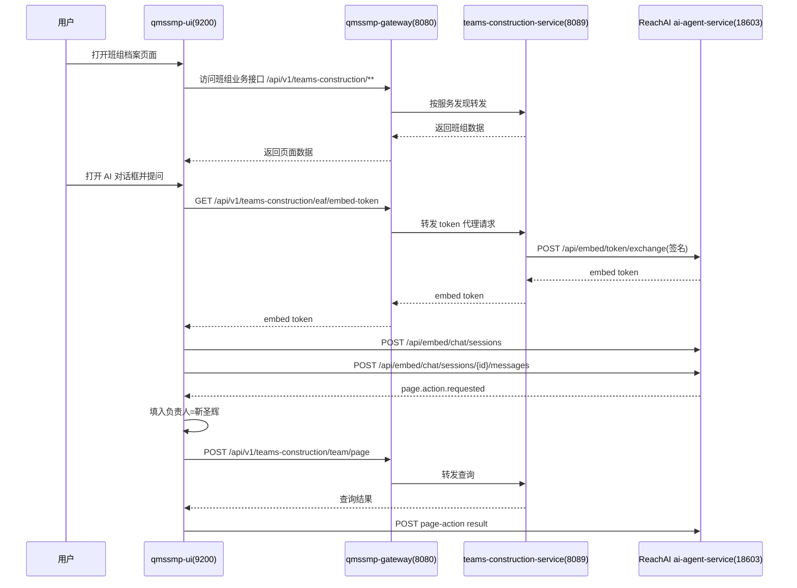

# ReachAI 嵌入式对话在班组系统微服务架构下的接入问题与方案讨论

## 1. 背景

当前目标是在班组业务系统的班组档案页面嵌入 ReachAI 对话框，让用户用自然语言驱动页面查询。例如：

```text
帮我查询一下负责人为靳圣辉的班组
```

期望效果是：

1. 用户在班组档案页面打开嵌入式对话框。
2. 前端向业务系统申请 ReachAI embed token。
3. 前端使用 embed token 与 ReachAI 中台建立嵌入式会话。
4. 用户发送自然语言。
5. ReachAI 中台运行页面助手 Agent，把自然语言转换为页面动作：

```json
{
  "type": "page.action.requested",
  "actionKey": "qmssmp.teamArchive.search",
  "args": {
    "managerName": "靳圣辉"
  }
}
```

6. 班组前端收到页面动作后，自动填入查询条件并触发班组列表查询。

这条链路已经完成了一部分基础接入：

- ReachAI 已有 JDK8 兼容接入 SDK 和 Spring Boot 2 starter。
- 班组后端已接入 ReachAI SDK，并声明了班组档案分页查询能力。
- 班组前端已能在班组档案页面显示 `AI` 对话入口。
- ReachAI 中台已支持 model-free 的 `DOCUMENT_EXTRACT + PAGE_ACTION` 工作流。
- ReachAI 中台已修复嵌入式 session 过期时间按 UTC 写入、本地时间校验导致刚创建 session 即过期的问题。

但是在真实班组系统联调时发现：不能简单让前端绕过网关直接访问班组服务实例。班组系统是微服务架构，前端、网关、业务服务、认证体系之间存在明确边界。

## 2. 当前系统拓扑

当前本地联调涉及的服务如下：

| 组件 | 本地端口 | 角色 |
| --- | --- | --- |
| `qmssmp-ui` | `9200` | 班组业务前端 |
| `qmssmp-gateway` | `8080` | 班组系统统一 API 网关 |
| `qmssmp-teams-construction-service` | `8089` | 班组建设业务服务 |
| `ai-agent-service` | `18603` | ReachAI 中台 Agent / Embed / Registry 服务 |
| Consul | `8500` | 班组系统服务发现 |

班组前端当前的主业务 API 配置为：

```text
http://localhost:8080/api/v1/
```

班组网关当前已有路由：

```yaml
- id: teams-construction-api-service
  uri: lb://qmssmp-teams-construction-service
  predicates:
    - Path=/api/v1/teams-construction/**
```

班组服务自身 controller 使用完整路径：

```text
/api/v1/teams-construction/...
```

例如班组档案分页查询接口：

```text
POST /api/v1/teams-construction/team/page
```

## 3. 当前联调暴露的问题

### 3.1 不能让前端直接打 8089

曾尝试把前端 `environment.api.v2.baseUrl` 从：

```text
http://localhost:8080/api/v1/
```

临时改为：

```text
http://localhost:8089/api/v1/
```

这样虽然看起来可以绕过网关访问班组服务，但马上暴露两个问题：

1. 登录和基础接口不在班组服务内。

前端登录依赖：

```text
/api/v1/basic/anonymous/login/public-key
```

该接口属于 `qmssmp-basic-service`，不是 `qmssmp-teams-construction-service`。前端全局 API 指到 8089 后，登录阶段会直接请求班组服务，导致接口不存在或 CORS 失败。

2. 浏览器跨域和鉴权链路被拆散。

班组前端运行在：

```text
http://localhost:9200
```

如果直接请求：

```text
http://localhost:8089
```

就绕过了网关的统一 CORS、认证、权限、服务发现和错误处理边界。即使某个接口能通，也不是业务系统真实生产接入形态。

结论：前端不能通过改全局 baseUrl 的方式直连班组服务实例。

### 3.2 网关路由存在，但仍需确认服务发现和转发是否实际可用

网关配置中已经有：

```text
Path=/api/v1/teams-construction/**
uri=lb://qmssmp-teams-construction-service
```

理论上，前端请求：

```text
http://localhost:8080/api/v1/teams-construction/team/page
```

应由网关通过 Consul 转发到班组服务。

但页面联调中出现了“访问的数据（页面）不存在”的错误，浏览器控制台里能看到班组相关接口请求失败，例如：

```text
http://localhost:8080/api/v1/teams-construction/team/page
http://localhost:8080/api/v1/teams-construction/team/buttonPermission
http://localhost:8080/api/v1/teams-construction/team/button-permission-export
```

这说明问题可能不在 ReachAI 对话框本身，而是在当前本地微服务运行环境中，网关到班组服务的路由、注册、鉴权或接口返回没有完全打通。

需要和同事确认：

- `qmssmp-teams-construction-service` 是否已经成功注册到 Consul。
- Consul 中服务名是否正好是 `qmssmp-teams-construction-service`。
- `qmssmp-gateway` 当前本地实例是否能发现该服务。
- 网关是否保留原始 path 转发，还是有 StripPrefix / RewritePath 之类的过滤器。
- 当前登录 token 是否能被网关转发并被班组服务识别。
- 班组服务是否要求某些网关注入的用户上下文 header。

### 3.3 ReachAI embed token 代理接口的位置需要重新确认

当前方案中，前端通过业务系统申请 ReachAI embed token，接口规划在班组服务侧：

```text
GET /api/v1/teams-construction/eaf/embed-token
```

这个接口的职责是：

1. 读取当前业务系统登录用户。
2. 组装 ReachAI 需要的业务身份 principal。
3. 使用班组服务的 `appKey/appSecret` 向 ReachAI 中台 `/api/embed/token/exchange` 发起签名请求。
4. 把中台返回的短期 embed token 返回给前端。

在微服务架构下，这个接口也不应该由前端直连 8089，而应该通过网关访问：

```text
http://localhost:8080/api/v1/teams-construction/eaf/embed-token
```

原因：

- 前端登录态、Authorization header、用户上下文均以网关入口为准。
- 网关可能承担统一鉴权、审计、限流、跨域、路径治理。
- 直接访问 8089 会导致本地可用、生产不可用的假象。

### 3.4 ReachAI 中台直连还是经业务网关需要明确边界

嵌入式对话至少有两类请求：

1. 业务前端向业务系统申请 embed token。
2. 业务前端拿到 embed token 后，向 ReachAI 中台创建 session、发送 message、回传 page action result。

当前实现倾向于：

```text
qmssmp-ui -> qmssmp-gateway -> qmssmp-teams-construction-service -> ReachAI token exchange
qmssmp-ui -> ReachAI ai-agent-service embed chat API
```

也就是说，token 申请走业务系统网关，后续 chat API 由前端直连 ReachAI 中台。

这个边界在技术上是合理的，但需要确认组织和部署策略是否接受：

- 浏览器是否允许访问 ReachAI 域名。
- ReachAI 是否配置业务系统页面 origin 白名单。
- ReachAI embed API 是否作为跨域公开入口暴露。
- 如果生产环境不允许前端直连 ReachAI，则需要由业务网关增加 ReachAI 反向代理路径。

## 4. 问题根因总结

当前问题不是单纯的“某个接口写错了”，而是嵌入式对话跨越了三套边界：

1. 业务系统内部微服务边界。

前端不直接知道班组服务实例地址，只知道网关地址。班组服务也可能依赖网关传递的认证上下文。

2. 业务系统与 ReachAI 中台边界。

ReachAI 需要可信业务服务签发 embed token，不能让前端自己伪造业务身份。

3. 页面动作与业务 API 边界。

ReachAI 只产出页面动作，不应该直接替页面调用业务接口。页面动作最终仍由业务前端用当前登录用户身份触发已有业务查询。

因此，正确接入方案必须围绕“网关优先、业务服务签发 token、前端执行页面动作、中台只做运行编排”来设计。

## 5. 建议目标架构

建议采用以下调用链：



这个方案的关键点：

- 班组业务 API 仍走 `qmssmp-gateway`。
- embed token 申请也走 `qmssmp-gateway`。
- ReachAI chat API 可以由前端直连 ReachAI，但必须有 CORS origin 白名单和短期 token 保护。
- ReachAI 不直接调用班组业务查询接口，避免绕过用户权限。
- 页面动作由当前页面执行，因此天然复用当前用户登录态、前端状态和页面权限。

## 6. 需要同事一起确认的方案点

### 6.1 网关路由是否作为唯一前端入口

建议确认结论：

```text
qmssmp-ui 访问所有业务系统接口，都必须以 qmssmp-gateway 为入口。
```

如果确认是，则前端不应该配置：

```text
http://localhost:8089/api/v1/
```

而应继续使用：

```text
http://localhost:8080/api/v1/
```

### 6.2 本地联调的服务发现如何保证

当前网关使用：

```text
lb://qmssmp-teams-construction-service
```

因此本地联调必须保证：

- Consul 在 `localhost:8500` 正常运行。
- `qmssmp-gateway` 注册成功。
- `qmssmp-teams-construction-service` 注册成功。
- 服务名一致。
- 网关健康检查能看到班组服务是健康实例。

如果本地不想依赖 Consul，可以讨论是否增加一个 local profile，例如：

```yaml
spring:
  cloud:
    gateway:
      routes:
        - id: teams-construction-api-service-local
          uri: http://localhost:8089
          predicates:
            - Path=/api/v1/teams-construction/**
```

这个方案只建议用于本地开发 profile，不建议替代生产服务发现。

### 6.3 网关是否需要新增 ReachAI 代理路由

如果生产环境允许前端直接访问 ReachAI 中台，则不需要业务网关代理 chat API，只需要：

- ReachAI 中台开放 `/api/embed/**`。
- ReachAI 中台 CORS 白名单包含业务系统 origin。
- embed token 短期有效，且绑定 `appId/projectCode/agentId/pageInstanceId/origin/route/externalUserId`。

如果生产环境不允许前端直连 ReachAI，则需要在业务系统网关增加代理路径，例如：

```text
/api/v1/reachai/embed/**
```

转发到：

```text
ReachAI /api/embed/**
```

这时前端配置应从：

```text
reachAi.apiBase = http://localhost:18603
```

调整为：

```text
reachAi.apiBase = http://localhost:8080/api/v1/reachai
```

但这种方案会让业务网关也承担 ReachAI 流量，需要额外确认：

- 网关是否允许透传 `Authorization: Bearer <embed-token>`。
- 网关认证过滤器是否会误把 embed token 当成业务 JWT。
- 是否要把 `/api/v1/reachai/embed/**` 加到匿名或特殊鉴权白名单。

### 6.4 token 代理接口应该在哪一层

建议 token 代理接口保留在业务服务中：

```text
teams-construction-service
```

而不是放在前端或网关中。

原因：

- 业务服务能读取当前业务用户身份。
- 业务服务保存 ReachAI `appSecret`，前端不能持有密钥。
- 业务服务可以按业务权限决定用户是否允许打开某个页面助手。
- 后续可以在业务服务里补充组织、岗位、角色等业务上下文。

### 6.5 页面动作是否只做前端状态变更

建议明确：

```text
ReachAI page action 只描述页面动作，不直接调用业务接口。
```

例如：

```json
{
  "actionKey": "qmssmp.teamArchive.search",
  "args": {
    "managerName": "靳圣辉"
  }
}
```

实际执行由前端完成：

1. 设置负责人输入框。
2. 合并当前分页条件。
3. 调用现有 `teams-construction/team/page` 接口。
4. 把结果回传给 ReachAI 审计。

这样可以避免 ReachAI 越权访问业务系统。

## 7. 推荐落地步骤

### 第一阶段：先打通微服务基础链路

目标：不考虑 AI，对普通班组档案页面先做到完全可用。

验收项：

- 前端使用 `http://localhost:8080/api/v1/`。
- 登录成功。
- 班组档案页面能通过 8080 网关查询列表。
- 以下接口不再出现 404 或路由失败：

```text
GET  /api/v1/teams-construction/team/buttonPermission
GET  /api/v1/teams-construction/team/button-permission-export
POST /api/v1/teams-construction/team/page
```

需要排查：

- Consul 服务列表。
- 网关路由命中情况。
- 网关转发日志。
- 班组服务是否收到请求。
- 前端 token 是否被网关正确透传。

### 第二阶段：打通 embed token 代理

目标：前端通过网关向班组服务申请 ReachAI embed token。

验收项：

```text
GET http://localhost:8080/api/v1/teams-construction/eaf/embed-token
```

能够返回：

```json
{
  "token": "...",
  "expiresIn": 1800,
  "sessionHint": {
    "appId": "qmssmp-teams-construction-service",
    "agentId": "team-archive-assistant",
    "pageInstanceId": "..."
  }
}
```

需要确认：

- 该接口是否需要登录。
- 当前用户如何从班组系统上下文里读取。
- 返回给 ReachAI 的 `externalUserId/globalUserId/userName/roles` 是否符合平台身份模型。

### 第三阶段：打通 ReachAI chat API

目标：前端拿到 embed token 后，能创建 ReachAI session 并发送消息。

验收项：

```text
POST /api/embed/chat/sessions
POST /api/embed/chat/sessions/{sessionId}/messages
```

能够返回 `uiRequest.extension.pageActionRequest`。

需要确认：

- ReachAI CORS 白名单包含 `http://localhost:9200`。
- ReachAI 项目凭据中配置了允许的 `agentId`。
- `team-archive-assistant` Agent 已存在并启用。
- 中台数据库已执行班组页面助手 seed 或已手工配置对应 Agent。

### 第四阶段：打通页面动作执行

目标：用户输入自然语言后，页面自动填入并查询。

验收项：

- 输入：

```text
帮我查询一下负责人为靳圣辉的班组
```

- 页面负责人字段变成：

```text
靳圣辉
```

- 页面自动触发班组分页查询。
- 查询结果展示在表格中。
- 前端向 ReachAI 回传 `page.action.result`。

## 8. 当前建议的优先决策

建议先和同事讨论并定下以下 4 个结论：

1. 班组前端是否必须统一走 `qmssmp-gateway`。
2. 本地联调时，网关是继续依赖 Consul，还是增加 local profile 直连 8089。
3. ReachAI chat API 是否允许前端直连，还是必须经业务网关代理。
4. embed token 代理接口是否确认放在 `teams-construction-service`，并由网关转发访问。

在这 4 点明确之前，不建议继续通过临时改端口、绕网关、放开 CORS 的方式推进，否则容易得到一个本地能跑但不符合微服务生产架构的方案。

## 9. 建议结论

推荐方案是：

```text
班组业务 API：qmssmp-ui -> qmssmp-gateway -> teams-construction-service
embed token：qmssmp-ui -> qmssmp-gateway -> teams-construction-service -> ReachAI
chat API：qmssmp-ui -> ReachAI
页面动作：ReachAI -> qmssmp-ui -> qmssmp-gateway -> teams-construction-service
```

如果生产安全策略不允许前端直连 ReachAI，则替代为：

```text
chat API：qmssmp-ui -> qmssmp-gateway -> ReachAI
```

但该替代方案需要额外设计网关白名单和 `Authorization` 透传规则，避免业务 JWT 与 ReachAI embed token 混用。
