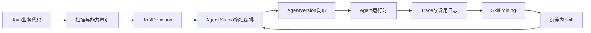

# 企业 Agent 开发与 Java 业务融合定位

> 本文用于沉淀 Enterprise Agent Framework 后续产品定位与关键技术方向：如何助力企业 Agent 开发，如何与传统 Java 项目深度结合，以及如何把固定业务流程、拖拽编排、运行时变量和业务系统真正打通。

## 一、核心定位

Enterprise Agent Framework 不应只定位为一个“Agent 聊天框架”，也不应走向泛化低代码平台。更准确的定位是：

**面向 Java 企业系统的 Agent 开发与治理中台。**

它的核心价值是把企业已有 Java 业务系统中的接口、服务、流程、权限、数据和审计能力，转化为 Agent 可以理解、可以调用、可以编排、可以治理、可以观测的能力资产。

一句话表达：

**让 Java 企业把已有业务接口快速变成可拖拽、可治理、可观测、可复用的 Agent 能力。**

当前项目已有的扫描项目、动态 Tool、AI 语义理解、Agent Studio、Tool ACL、Trace、Skill Mining、接口图谱等能力，已经具备向这个方向演进的基础。

## 二、三层产品价值

### 2.1 让 Agent 看见业务能力

通过 OpenAPI / Spring Controller 扫描，把历史 Java 系统中的 HTTP 接口注册为动态 Tool。

当前主线已经基本成立：

```text
扫描项目 -> tool_definition -> DynamicHttpAiTool -> Agent 调用历史系统 HTTP 接口
```

这解决的是“有没有能力”的问题。

### 2.2 让 Agent 看懂业务能力

仅扫描接口名和参数结构是不够的。企业接口常见问题是：

- Swagger 描述为空或过于技术化。
- 方法名无法体现真实业务语义。
- 参数含义、返回值、调用前置条件、业务注意事项没有进入 Agent 上下文。
- Agent 在多个相似接口之间容易选错。

因此需要继续强化 AI 语义理解：

- 项目级：理解项目所属业务域和模块地图。
- 模块级：理解 Controller / Service / Mapper 形成的业务能力组。
- 接口级：结合方法体、Service 调用、DTO 字段、JavaDoc 生成面向 Agent 的业务说明。

接口级结果应继续写入 `tool_definition.ai_description`，让运行时 Tool 描述优先使用业务语义，而不是原始接口名。

这解决的是“懂不懂能力”的问题。

### 2.3 让 Agent 稳定执行业务流程

固定流程不应该完全交给 ReAct 临场推理。

例如：

```text
查询客户 -> 校验额度 -> 创建合同 -> 发起审批 -> 通知负责人
```

这种流程如果每次由 LLM 自己决定步骤，生产上会存在跳步、漏步、参数错传和重复调用风险。

更合理的分工是：

- Java 业务代码负责原子能力和事务正确性。
- Agent Studio 负责流程编排、节点关系、参数映射和版本发布。
- LLM 负责意图理解、参数抽取、自然语言解释和缺参追问。
- Skill 负责把高频稳定流程封装成粗粒度业务能力。

这解决的是“稳不稳执行”的问题。

## 三、与传统 Java 项目的三种结合深度

### 3.1 轻接入：零改造扫描接口

适合历史系统、遗留系统、短期 PoC。

接入方式：

1. 管理端录入项目名称、域名、磁盘路径。
2. 扫描 OpenAPI 或 Spring Controller。
3. 生成 `tool_definition`。
4. 运营或开发补充描述、启停、权限、副作用等级。
5. Agent 通过 `DynamicHttpAiTool` 调用原业务系统。

优点是接入快、对历史系统侵入小。

不足是业务语义、权限上下文、变量关系和流程稳定性需要后续补齐。

### 3.2 中接入：业务代码声明 Agent 能力

对于可改造的 Java 项目，建议引入结构化能力声明，而不是只依赖扫描推断。

可以设计类似注解：

```java
@AiCapability(
    name = "queryCustomerCredit",
    title = "查询客户授信额度",
    description = "根据客户ID查询当前可用授信额度",
    domain = "finance",
    sideEffect = SideEffectLevel.READ_ONLY,
    tags = {"客户", "授信", "额度"}
)
@PostMapping("/customer/credit/query")
public CreditVO queryCredit(@RequestBody CreditQueryRequest request) {
    // business code
}
```

参数也应支持结构化描述：

```java
public class CreditQueryRequest {

    @AiParam(
        description = "客户ID",
        sourceHint = "通常来自 queryCustomer.response.data.customerId"
    )
    private Long customerId;
}
```

这类注解的目标不是替代业务代码，而是让平台在扫描时获得更可靠的能力元数据：

- 能力名称。
- 业务标题。
- 业务描述。
- 所属领域。
- 标签。
- 副作用等级。
- 参数说明。
- 参数来源提示。
- 权限建议。
- 是否可被 Agent Studio 拖拽。

因此，“在业务代码中写一个 `@标签`，平台上即可拖拽为节点”这个方向是成立的，但这个标签必须是结构化的能力声明，而不是简单文本备注。

### 3.3 深接入：SDK + 上下文 + 事件

对于新系统、核心系统或长期要规模化使用的系统，可以提供更深的 SDK 接入。

深接入应覆盖：

- 主动注册 Tool / Skill。
- 透传登录用户、租户、角色、部门等业务上下文。
- 接入业务字典，如部门、人员、客户、产品、状态枚举。
- 接入业务事件，如订单创建、审批通过、合同归档。
- 接入企业权限体系和审计体系。
- 接入事务边界和幂等机制。

深接入的目标是让 Agent 进入企业已有治理体系，而不是绕过业务系统直接操作数据。

## 四、可拖拽节点的本质

Agent Studio 里的拖拽节点不应是任意代码块，而应是经过治理的能力资产。

建议节点类型逐步收敛为：

```text
Tool              原子业务能力，通常对应一个接口或方法
Skill             多个 Tool 封装后的粗粒度能力
InteractiveForm   带槽位补全、字典选择、用户确认的交互式能力
Knowledge         知识库检索能力
Condition         条件判断节点
HITL              人工审批节点
Start / End       流程起止节点
```

一个节点至少需要具备：

- `ref`：引用哪个 Tool / Skill / Knowledge。
- `inputMapping`：入参来自哪里。
- `outputAlias`：输出结果在流程变量中的名称。
- `sideEffect`：副作用等级。
- `acl`：谁可以使用。
- `retry / timeout`：可靠性配置。
- `trace`：运行时可观测信息。

拖拽的本质不是“画图”，而是把这些结构化元数据组合为一个可发布、可回滚、可审计的 Agent 版本。

## 五、固定流程如何与业务代码结合

固定流程建议采用“代码原子能力 + 画布流程编排 + Skill 沉淀”的模式。



落地原则：

1. 单个业务动作沉淀为 Tool。
2. 多步稳定流程沉淀为 Skill。
3. 需要用户补全信息的流程沉淀为 InteractiveFormSkill。
4. 复杂但边界清晰的子域沉淀为 SubAgentSkill。
5. 高频 Trace 中反复出现的调用链，通过 Skill Mining 进入草稿评审。
6. 评审通过后成为可复用 Skill，再回到 Studio 供拖拽使用。

## 六、运行时变量如何与业务系统融合

Agent 调用过程中的变量不应只是临时 JSON，而应设计为企业级的 Agent Execution Context。

### 6.1 用户上下文变量

来自业务网关、登录态或调用方系统。

典型字段：

```text
userId
tenantId
roles
deptId
orgId
locale
channel
```

这些变量应进入 `ChatRequest`，并在 Tool / Skill 调用链路中通过上下文透传。

### 6.2 会话变量

来自用户自然语言、多轮对话和交互式表单。

典型内容：

```text
当前客户
当前订单
当前合同
时间范围
用户已确认的字段
挂起中的表单槽位
```

会话变量适合与 `InteractiveFormSkill`、短期记忆和挂起 / 恢复机制结合。

### 6.3 流程变量

来自画布节点之间的数据传递。

典型形式：

```text
queryCustomer.output.data.customerId
queryOrder.output.orderNo
createApproval.output.instanceId
```

流程变量应支持在 Studio 中可视化映射：

```text
queryCustomer.response.data.customerId
  -> createContract.request.customerId
```

### 6.4 业务对象变量

来自企业真实业务对象。

典型形式：

```text
customer.id
customer.name
order.orderNo
contract.contractId
approval.instanceId
```

业务对象变量应尽量通过接口图谱、DTO 字段和语义理解建立关系，而不是依赖运营手工猜字段。

## 七、接口图谱的关键价值

接口图谱不应只是一个可视化展示工具，它更重要的价值是反哺 Agent 调用链路。

核心问题是：

**哪个接口的出参，通常可以作为另一个接口的入参？**

例如：

```text
queryCustomer.response.data.customerId
  -> createContract.request.customerId
```

这类关系一旦被推断和确认，就可以反哺三个地方：

1. Tool 描述：让 Agent 看到参数来源提示。
2. Agent Studio：选中节点时提示缺少哪些前置节点。
3. Tool Retrieval：让召回结果更理解接口之间的组合关系。

推荐闭环：

```mermaid
flowchart LR
  scan["扫描接口"] --> semantic["AI语义理解"]
  semantic --> graph["接口图谱投影"]
  graph --> infer["候选边推断"]
  infer --> review["运营确认"]
  review --> hints["参数来源提示"]
  hints --> studio["Studio参数映射"]
  hints --> agent["Agent选Tool与填参"]
  agent --> trace["运行时Trace"]
  trace --> infer
```

这条链路能让平台从“能调用接口”升级为“知道接口之间如何协作”。

## 八、建议的能力声明模型

后续可以考虑设计一组 Java 注解或 SDK 元数据模型。

### 8.1 `@AiCapability`

用于声明一个方法或接口是否可成为 Agent 能力。

建议字段：

```text
name
title
description
domain
module
tags
sideEffect
visible
agentVisible
requiredRoles
timeoutMs
retryLimit
```

### 8.2 `@AiParam`

用于声明参数语义。

建议字段：

```text
description
required
example
sourceHint
dictType
sensitive
```

### 8.3 `@AiOutput`

用于声明输出字段语义。

建议字段：

```text
description
businessKey
canBeSourceFor
sensitive
```

### 8.4 `@AiWorkflow`

用于声明代码侧已经稳定存在的业务流程。

适用于固定编排场景：

```text
name
description
steps
inputSchema
outputSchema
sideEffect
```

不过需要注意：`@AiWorkflow` 不应把平台变成 Java DSL 工作流引擎。它更适合作为“已有稳定业务流程”的能力声明，真正的运营编排仍放在 Agent Studio。

## 九、后续演进优先级

### 9.1 第一优先级：能力声明标准化

设计 Java 注解或 SDK 元数据，让业务项目可以明确声明哪些接口是 Agent 能力。

目标：

- 降低纯扫描误判。
- 提升 Tool 描述质量。
- 为 Studio 节点提供稳定元数据。

### 9.2 第二优先级：变量映射体系

Agent Studio 需要支持：

- 节点输出引用。
- 节点入参绑定。
- 用户上下文变量。
- 会话变量。
- 缺参追问。
- 默认值与表达式。

没有变量映射，画布只能展示能力，不能稳定执行流程。

### 9.3 第三优先级：接口图谱反哺 Agent

将 `REQUEST_REF / RESPONSE_REF` 确认关系写入 Tool 描述和 Studio 参数提示。

目标：

- 提升 Agent 填参准确率。
- 降低运营配置成本。
- 支持一键添加前置 Tool。

### 9.4 第四优先级：固定流程 Skill 化

把高频稳定调用链从 ReAct 中拿出来，沉淀为 Skill。

来源包括：

- 工程手写。
- Studio 编排发布。
- Trace 挖掘生成草稿。
- 运营评审上架。

### 9.5 第五优先级：企业治理补齐

继续补齐生产必需能力：

- Tool / Skill ACL。
- 副作用等级。
- 限流。
- HITL。
- Trace。
- 版本灰度。
- 回滚。
- 审计。

这些能力是与普通 Demo Agent 拉开差距的关键。

## 十、阶段性结论

Enterprise Agent Framework 后续应坚持一个主线：

**不是让 Agent 简单调用 Java 接口，而是让 Java 企业的业务能力被 Agent 正确理解、稳定编排、安全执行、持续沉淀。**

围绕这条主线，平台要持续把四件事做深：

1. 业务能力资产化：从接口、方法、流程中抽取 Agent 可用能力。
2. 业务语义结构化：让 Agent 理解能力的用途、参数、返回值和约束。
3. 业务流程可编排：让固定流程通过 Studio 和 Skill 稳定运行。
4. 业务治理平台化：让权限、副作用、限流、审批、审计、Trace 成为内建能力。

最终目标是让企业 Java 团队可以用熟悉的技术栈，把已有系统渐进式升级为 Agent 可调用、可组合、可运营的智能业务底座。
